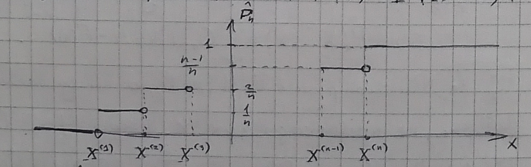

---
output:
  pdf_document:
    latex_engine: xelatex
    number_sections: true
linkcolor: blue

mainfont: Linux Libertine O
fontsize: 12pt
numbersections: true
indent: true

header-includes:
- \usepackage{indentfirst}
- \usepackage[russian, english]{babel}
- \usepackage{fancyhdr}
- \usepackage{cancel}

- \pagestyle{fancy}
- \newcommand{\R}{\mathbb{R}}
- \newcommand{\Ll}{\mathbb{L}}
- \newcommand{\N}{\mathbb{N}}

- \setlength{\headheight}{15pt} 
---
\input{./files/title.tex}

\tableofcontents
\clearpage

# Источники {-}

* [Ивченко Г. И., Медведев Ю. И. "Математическая статистика", изд. "Высшая школа", 1984](https://www.hse.ru/pubs/share/direct/content_document/103185710)

* [Кибзун А. И., Наумов А. В., Горяинова Е. Р. "Теория вероятностей и математическая статистика. Базовый курс с примерами и задачами", изд "ФИЗМАТЛИТ", 2013](https://ami.nstu.ru/~post/teaching/tv_ms/kibzun.pdf)

* [Панков А. Р., Платонов Е. Н. "Практикум по математической статистике", изд. "МАИ", 2006](http://zyurvas.narod.ru/knyhy2/Pankov_matstat.pdf)

\pagebreak

# Многомерное нормальное распределение

## Замечание {-}

Вектор $X = (X_{1}, \dots, X_{n})^{T}$ называется ***случайным***, если $X_{1}, \dots, X_{n}$ --- *случайные величины* *(далее **с.в**)*, определенные на одном вероятностном пространстве.

Через $M[X] = m_{X}$ обозначим ***вектор математического ожидания***:

\begin{align*}
M[X] = m_{X} = 
    \begin{pmatrix}
    M[X_1] \\
    \vdots \\
    M[X_n]
    \end{pmatrix}
\end{align*}

Через $K_x$ обозначим *ковариационную матрицу* с.в $X$:

\begin{align*}
K_{X} = 
    \begin{pmatrix}
    \mathrm{cov}(X_1, X_1) & \dots & \mathrm{cov}(X_1, X_n) \\
    \vdots & \ddots & \vdots   \\ 
    \mathrm{cov}(X_n, X_1) & \dots & \mathrm{cov}(X_n, X_n) \\
    \end{pmatrix}
\end{align*}

## Лемма 1

Пусть $K_{X} \in \R^{n \times n}$ --- ковариационная матрица с.в $X$. Тогда:

1. $K_{X} \geqslant 0$, т.е. $\forall x \in \R^{n} \backslash \{0\}, x^{T}K_{X}x \geqslant 0$;

2. $K_{X}^{T} = K_{X}$

## Определение 1

Случайный вектор $X = (X_1, \dots, X_n)^{T}$ называется ***невырожденным нормальным вектором***:

$$X \sim N(m_{X}, K_{X})$$

если совместная плотность вероятности имеет вид:

$$f_{X}(x) = ((2\pi)^{n} \det K_{X})^{\frac{-1}{2}} \exp\{\frac{-1}{2}(x - m_{X})^{T}K_{X}^{-1}(x - m_{X})\}$$

где $m_{X} \in \R^{n}, K_{X} \in \R^{n \times n}, K_{X} > 0, K_{x}^{T} = K_{X}$

## Лемма 2 {#lemma-1-2}

Пусть $X$ --- невырожденный нормальный вектор с параметрами $m_{X}$ и $K_{X}$.

Тогда $M[X] = m_{X}$, а $K_{X}$ --- корвариационная матрица $X$.

Рассмотрим основные свойства многомерного нормального распределения.

## Лемма 3 {#lemma-1-3}

Пусть $X \sim N(m_{X}, K_{X}), A \in \R^{m \times n}, b \in \R^{m}$.

Тогда:

\begin{align*}
Y = AX + b \sim N(m_Y, K_Y), \\
m_Y = Am_X + b, \\
K_Y = AK_XA^{T}.
\end{align*}

## Лемма 4 {#lemma-1-4}

Пусть $X \sim N(m_{X}, K_{X})$.

Тогда компоненты вектора $X$ ***независимы*** тогда и только тогда, когда они *некоррелированы*.

### note {-}

Доказательство данных утверждений при помощи аппарата функций распределения и плотности довольно сложно.
Поэтому рассмотрим аппарат характеристических функций.

## Определение 2

Пусть $X = (X_1, \dots, X_n)^{T}$ --- случайный вектор.

Тогда ***характеристической функцией*** называется:

<!-- $$\psi(\lambda) = M[e^{i\lambda^{T}X] = \int_\R^{n}e^{i\lambda^{T}X}dF_X(x)$$ -->
$$\psi_{X}(\lambda) = M[e^{i\lambda^{T}X}] = \int\limits_{\R^{n}}e^{i\lambda^{T}X}dF_X(x)$$

## Замечание {-}

*Характеристическая функция* определена для любого случайного вектора или с.в.

Если с.в **дискретная**, то:

$$\psi_{X}(\lambda) = \sum\limits_{k = 1}^{\infty}e^{i\lambda X_{k}}p_{k}$$

Если с.в **абсолютно непрерывная**, то

$$\psi_{X}(\lambda) = \int\limits_{\R}e^{i\lambda X}f_{X}(x)dx$$

В этом случае $\psi_{X}(\lambda)$ является ***преобразованием Фурье $f_X$***.

Поскольку преобразование Фурье взаимно однозначно, а $f_X$ однозначно определяет распределение, то характеристическая функция $\psi_{X}(x)$ также однозначно определяет распределение с.в $X$.

Причем:

$$f_{X}(x) = \frac{1}{(2\pi)^{n}} \int\limits_{\R}e^{-i\lambda^{T} X}\psi_{X}(x)d\lambda$$

## Лемма 5 {#lemma-1-5}

Пусть $X$ --- случайный вектор, $A \in \R^{n \times n}, b \in \R^{n}$.

Тогда:

1. для $Y = AX + b$
$$\psi_{Y}(\lambda) = e^{i\lambda^{T}b} \psi_{X}(A^{T}\lambda)$$

2. компоненты вектора $X$ ***независимы*** тогда и только тогда, когда
$$\psi_{Y}(\lambda) = \prod\limits_{k = 1}^{n} \psi_{X_k}(\lambda_k)$$

### Доказательство {-}

1. $\psi_{Y}(\lambda) = M[e^{i\lambda^{T}Y}] = M[e^{i\lambda^{T} AX} e^{i\lambda^{T} b}] 
= e^{i\lambda^{T} b} M[e^{i(A^{T}\lambda)^{T} X}] = e^{i\lambda^{T} b} \psi_{X}(A^{T}\lambda)$

2. $\psi_{X}(\lambda) = \int\limits_{\R} \dots \int\limits_{\R} e^{i(\lambda_{1} x_{1} + \dots + \lambda_{n} x_{n})} f_{X}(x_1, \dots, x_n)dx_1 \cdot \dots \cdot dx_n =$
{н/з} $= \int\limits_{\R} e^{i\lambda_{1} x_{1}} \cdot \dots \cdot e^{\lambda_{n}
x_{n}} \cdot f_{X_{1}}(x) \cdot \dots \cdot f_{X_{n}}dx_1 \cdot \dots \cdot dx_n =
\int\limits_{\R} e^{i\lambda_{1} x_{1}} f_{x_1}(x_1)dx_1 \cdot \dots \cdot \int\limits_{\R} e^{i\lambda_{n} x_{n}} f_{x_n}(x_n)dx_n=
\prod\limits_{k = 1}^{n} \psi_{X_k}(\lambda_{k})$

$\blacksquare$
<!-- mb make a bit pretty later -->

## Замечание {-}

При помощи характеристической функции можно дать другое определение нормального распределения. В том числе для вырожденного $K_{X}$.

## Определение 3

Случайный вектор $X$ называется ***нормальным***: $X \sim N(m_{X}, K_{X})$, если:

$$\psi_{X}(\lambda) = \exp\{i\lambda^{T} m_{X} - \frac{1}{2} \lambda^{T} K_{X}\lambda \}$$

### Доказательство леммы 3

В силу [Леммы 5, п.1](#lemma-1-5)

\begin{align*}
\psi_{Y}(\lambda) = e^{i\lambda^{T}b} \psi_{X}(A^{T}\lambda) = e^{i\lambda^{T}b} \exp\{i\lambda^{T} Am_x - \frac{1}{2} \lambda^{T}
AK_{X}A^{T}\lambda\} = \\
= \exp\{i\lambda^{T} (Am_x + b) - \frac{1}{2}\lambda^{T} (AK_xA^{T})\lambda\} \\
\blacksquare
\end{align*}

### Доказательство леммы 4

Пусть $X_{i}, \dots, X_{n}$ *попарно некоррелированы*. Тогда $cov(X_{i}, X_{j}) = 0$, $i \ne 0$, т.е. :

\begin{align*}
K_x = diag(\sigma_{X_1}^{2}, \dots, \sigma_{X_n}^{2}) = \\
    =  
    \begin{pmatrix}
    \sigma_{X_1}^{2} & \dots & 0 \\
    \vdots & \ddots & \vdots   \\ 
    0 & \dots & \sigma_{X_n}^{2} \\
    \end{pmatrix}
\end{align*} 

$\psi_{X}(\lambda) = \exp\{i\lambda_{1} m_{X_1} + \dots + i\lambda_{n} m_{X_n} - \frac{1}{2} \lambda^{T} K_{X} \lambda \} =
\exp\{i\lambda_{1} m_{X_1} + \dots + i\lambda_{n} m_{X_n} - \frac{1}{2}(\lambda_{1}^{2} \sigma_{X_1}^{2} + \dots + 
\lambda_{n}^{2} \sigma_{X_n}^{2})\} = \prod\limits_{k = 1}^{n} \exp\{i\lambda_{n} m_{X_n} - \frac{1}{2} \lambda_{k}^{2} \sigma_{K_n}^{2}\} = \prod\limits_{k = 1}^{n} \psi_{X_k} (\lambda_{k})$.

Откуда с учетом [Леммы 5, п.1](#lemma-1-5) $X_1, \dots, X_n$ --- н/з.

Пусть $X_1, \dots, X_n$ --- н/з. Тогда $X_1, \dots, X_n$ *попарно некоррелированы*. $\blacksquare$

## Замечание {-}

Поскольку $K_{X}$ --- невырожденная, симметричная и положительноопределенная, то существует $S \in \R^{n \times n}$ --- *ортогональная*
(т. е. $S^{T} = S^{-1}$) такая, что:

$$S^{T}K_{X}S = \Lambda = diag(\lambda_1, \dots, \lambda_n)$$

где $\lambda_{i} > 0, i = \overline{1, n}$

Определим матрицу $\Lambda^{- \frac{1}{2}} = diag(\lambda_{1}^{- \frac{1}{2}}, \dots, \lambda_{n}^{- \frac{1}{2}})$.

Рассмотрим вектор

$$Y = \Lambda^{- \frac{1}{2}} S^{T}(X - m_{X})$$

Тогда $A = \Lambda^{- \frac{1}{2}}S^{T}, b = - \Lambda^{- \frac{1}{2}}S^{T}m_{X}$.

В силу [Леммы 3](#lemma-1-3):

$$m_{Y} = Am_{X} + b = \Lambda^{- \frac{1}{2}}S^{T} - \Lambda^{- \frac{1}{2}}S^{T}m_{X} = 0,$$
$$K_{Y} = AK_{X}A^{T} = \Lambda^{- \frac{1}{2}}S^{T}K_{X}S\Lambda^{- \frac{1}{2}} = I,$$

т. е. $Y \sim N(0, I)$.

При помощи невырожденного линейного преобразования с.в. $X$ может быть преобразован в стандартный нормальный вектор. 

Верно и обратное:

$$X = m_{X} + S\Lambda^{\frac{1}{2}} Y,$$

откуда следует [Лемма 2](#lemma-1-2)

\pagebreak

# Теорема о нормальной корреляции

## Определение 1

***Условным математическим ожиданием абсолютно непрерывного случайного вектора*** $X$ относительно абсолютно непрерывного случайного вектора $Y$ называется:

$$M[X \mid Y] = \int\limits_{- \infty}^{+ \infty} xf_{X | Y} (x \mid Y)dx,$$

где $f_{X \mid Y} (x \mid Y) = \frac{f_{z}(x, Y)}{f_{y}(Y)}, z = 
\begin{pmatrix}
    X \\
    Y \\
\end{pmatrix}$

## Основные свойства условного М. О.

### Свойство 1 {#attr-1-1}

\fbox{$M[C \mid Y] = C$}

**\underline{Доказательство}**

$M[C \mid Y] = \int\limits_{- \infty}^{+ \infty} Cf_{X \mid Y} (x \mid Y)dx = \frac{C \int\limits_{- \infty}^{+ \infty} f_{z}(x, Y)dx}
{f_{Y}(Y)} = C \frac{f_{Y}(Y)}{f_{Y}(Y)} = C$. $\blacksquare$

### Свойство 2 {#attr-1-2}

\fbox{$M[X \phi(Y) | Y] = \phi(Y)M[X \mid Y]$}

**\underline{Доказательство}**

$M[\phi(Y) X \mid Y] = \int\limits_{- \infty}^{+ \infty} \phi(Y)X f_{X \mid Y}(x \mid Y)dx = \phi(Y) \int\limits_{- \infty}^{+ \infty} x
f_{X \mid Y} (x \mid Y)dx =$

$= \phi(Y) M[X \mid Y]$. $\blacksquare$

### Свойство 3 {#attr-1-3}

\fbox{$M[\alpha X_{1} + \beta X_{2} \mid Y] = \alpha M[X_{1} \mid Y] + \beta M[X_{2} \mid Y]$}

### Свойство 4 {#attr-1-4}

Пусть $X, Y$ --- *независимые*. Тогда \fbox{$M[X \mid Y] = M[X]$}

**\underline{Доказательство}**

$M[X \mid Y] = \int\limits_{- \infty}^{+ \infty} xf_{X \mid Y} (x \mid Y)dx = \int\limits_{- \infty}^{+ \infty} x \frac{f_{z}(x, Y)}
{f_{Y}(Y)}dx = \int\limits_{- \infty}{+ \infty}x \frac{f_{X}(x) f_{Y}(Y)}{f_{Y}(Y)} dx = M[X]$. $\blacksquare$

### Свойство 5 {#attr-1-5}

\fbox{$M[M[X \mid Y]] = M[X]$} ***(формула повторного М. О.)***

\pagebreak

**\underline{Доказательство}**

$M[M[X \mid Y]]= \int\limits_{- \infty}^{+ \infty} M[X \mid Y] f_{Y} (y)dy = \int\limits_{- \infty}^{+ \infty} f_{Y}(y) 
\int\limits_{- \infty}^{+ \infty} x f_{X \mid Y} (x \mid y)dxdy = \int\limits_{- \infty}^{+ \infty}
\int\limits_{- \infty}^{+ \infty} x \frac{f_{Y}(y) f_{z}(x, y)}{f_{Y}(y)} dydx = \int\limits_{- \infty}^{+ \infty} x
\int\limits_{- \infty}^{+ \infty} f_{z} (x, y)dydx = \int\limits_{- \infty}^{+ \infty} x f_{X}(x)dx = M[X]$. $\blacksquare$

## Лемма 1 {#lemma-2-1}

Пусть $X, Y$ --- случайные векторы с конечными вторыми моментами. Тогда:

<!-- check power of 'phi(Y)..' -->
$M[(X - \hat{X})\phi(Y)^{T}] = 0$

где $\hat{X} = M[X \mid Y]$

### Доказательство {-}

$M[(X - \hat{X})\phi(Y)^{T}] = M[X \phi(Y)^{T}] - M[M[X \mid Y] \phi(Y)^{T}] =$

= по [Свойству 2](#attr-1-2) $= M[X \phi(Y)^{T}] - M[M[X \phi(Y)^{T} \mid Y]] =$ по [Свойству 5](#attr-1-5) $=
M[X \phi(Y)^{T}] - M[X \phi(Y)^{T}]
= 0$. $\blacksquare$

## Замечание {-}

Если рассмотреть евклидово пространство $\Ll_{2}(\Omega)$ со скалярным произведением:

$$(X, Y) = M[X \cdot Y]$$

то *условное* М. О. --- ***оператор ортогонального проектирования*** $X$ на подпространство, порождаемое $Y$.

## Определение 2

***Оценкой $X$ по наблюдениям $Y$*** называется любая измеримая функция $\phi(Y)$.

## Определение 3

***Оценка $\hat{X}$ называется с.к.-оптимальной оценкой $X$***, если для любой другой оценки $\tilde{X}$ верно

$$M[| \tilde{X} - \hat{X}|^{2}] \leqslant M[| X - \tilde{X} |^{2}]$$ 

## Теорема 1

$M[X \mid Y]$ --- ***с.к.-оптимальная оценка $X$ по наблюдениям $Y$***.

### Доказательство {-}

$M[|X - \tilde{X}|^{2}] = M[|X - \hat{X} + \hat{X} - \tilde{X}|^{2}] = M[|X - \hat{X}|^{2}] + 2M[(X - \hat{X})^{T} (\hat{X} -
\tilde{X})] + M[|\hat{X} - \tilde{X}|^{2}] \overset{*}{=}$

Поскольку по определению $\tilde{X} - \hat{X} = \phi(Y)$, то в силу [Леммы 2.1](#lemma-2-1) $M[(X - \hat{X})^{T}(\tilde{X} - \hat{X})] = 0$.

$\overset{*}{=} M[|X - \hat{X}|^{2}] + M[|\hat{X} - \tilde{X}|^{2}] \geqslant M[|X - \hat{X}|^{2}]$. $\blacksquare$

## Теорема 2 (О нормальной корреляции) {#theorem-2-2}

Пусть 
\begin{align*}
    \begin{pmatrix}
        X \\
        Y \\
    \end{pmatrix}
    \sim N
    \begin{pmatrix}
        \begin{pmatrix}
        m_{X} \\
        m_{Y} \\
        \end{pmatrix},
        \begin{pmatrix}
        K_{X} & K_{XY} \\
        K_{XY}^{T} & K_{Y} \\
        \end{pmatrix}
    \end{pmatrix}
\end{align*}

Тогда 

1. $Law(X \mid Y) = N(\mu(Y), \Delta)$,

где 

$$\mu(Y) = M[X \mid Y] = m_{X} + K_{XY}K_{Y}^{-1}(Y - m_{Y})$$

$$\Delta = K_{X} - K_{XY}K_{Y}^{-1}K_{YX}$$

2. $M[|X - \mu(Y)|^{2}] = tr(K_{X} - K_{XY}K_{Y}^{-1}K_{YX})$

### Доказательство {-}

Рассмотрим линейное преобразование $Y$:

$$\mu(Y) = m_{X} + K_{XY}K_{Y}^{-1}(Y - m_{Y})$$

В силу [Леммы 1.3](#lemma-1-3)

$X - \mu(Y) = (I - K_{XY}K_{Y}^{-1})
\begin{pmatrix}
    X \\
    Y \\
\end{pmatrix} -
m_{X} + K_{XY}K_{Y}^{-1}m_{Y} \sim N(\mu, K)$

$\mu = (I - K_{XY}K_{Y}^{-1})
\begin{pmatrix}
    m_{X} \\
    m_{Y} \\
\end{pmatrix} -
m_{X} + K_{XY}K_{Y}^{-1}m_{Y} = 0$

$K = (I - K_{XY}K_{Y}^{-1})
\begin{pmatrix}
    K_{X} & K_{XY} \\
    K_{XY}^{T} & K_{Y} \\
\end{pmatrix}
\begin{pmatrix}
    I \\ 
    -(K_{XY}K_{Y}^{-1})^{T} \\
\end{pmatrix} =$

$= \begin{pmatrix}
    K_{X} - K_{XY}K_{Y}^{-1}K_{XY}^{T} & K_{XY} - K_{XY}K_{Y}^{-1}K_{Y} \\
\end{pmatrix}
\begin{pmatrix}
    I \\
    K_{Y}^{-1}K_{XY}^{T} \\
\end{pmatrix} =$

$= K_{X} - K_{XY}K_{Y}^{-1}K_{XY}^{-1} = \Delta$

$cov(X - \mu(Y), Y) = cov(X, Y) - cov(\mu(Y), Y) = cov(X, Y) - cov(K_{XY}K_{Y}^{-1}Y + m_{X} - K_{XY}K_{Y}^{-1}m_{Y}, Y) =
cov(X, Y) - K_{XY}K_{Y}^{-1}cov(Y, Y) = K_{XY} - K_{XY}K_{Y}^{-2}K_{Y} = 0$

т.е. $X - \mu(Y)$ и $Y$ **некорреливаны**.

Тогда в силу [Леммы 1.5, п.2](#lemma-1-5) $X - \mu(Y)$ и $Y$ **независимы**. Построим характеристическую функцию условного распределения $X$
относительно $Y$:

$\psi_{X \mid Y}(\lambda \mid Y) = \int\limits_{\R^{n}} e^{i\lambda^{T} X} f_{X \mid Y}(x \mid Y)dx = M[e^{i\lambda^{T}X} \mid Y] =
M[e^{i\lambda^{T}(X - \mu(Y))} e^{i\lambda^{T} \mu(Y)} \mid Y] \overset{*}{=}$

в силу [Леммы 1.2](#lemma-1-2) и *независимости* $X - \mu(Y)$ и $Y$

$\overset{*}{=} M[e^{i\lambda^{T}(X - \mu(Y))} \mid Y] \cdot M[e^{i\lambda^{T}\mu(Y)} \mid Y] = M[e^{i\lambda^{T}(X - \mu(Y))}]
e^{i\lambda^{T} \mu(Y)} = \psi_{X - \mu(Y)}(\lambda) e^{i\lambda^{T} \mu(Y)} = \exp\{- \frac{1}{2} \lambda^{T} \Delta \lambda \}
\cdot \exp\{i\lambda^{T} \mu(Y) - \frac{1}{2} \lambda^{T} \Delta \lambda\}$

т.е. Условное распределение ***нормальное***:

$$X(Y \sim N(\mu(Y), \Delta)$$

Вычислим с.к. ошибку:

$M[|X - \mu(Y)|^{2}] = M[\Delta X_{1}^{2} + \Delta X_{2}^{2} + \dots + \Delta X_{n}^{2}] = \sum\limits_{k = 1}^{n}M[\Delta X_{k}^{2}] = 
\sum\limits_{k = 1}^{n} D[\Delta X_{k}] = \sum\limits_{k = 1}^{n} \Delta_{kk} = tr\Delta$. $\blacksquare$

## Замечание {-}

1. Из [Теоремы о нормальной корреляции](#theorem-2-2) следует, что в *гауссовском* случае с.к.-оптимальная оценка является ***линейной***.

2. Если $X$ и $Y$ --- *независимы*, то с.к.-оптимальная оценка --- $m_{X}$.

3. С.к.-оптимальная оценка ***несмещенная***, т.к. $M[X - \mu(Y)] = 0$. 

\pagebreak

# Виды сходимости последовательностей случайных величин

## Определение 1

Говорят, что $\{X_{n}\}_{n = 1}^{\infty}$ образует ***последовательность случайных величин***, если $\forall N \in \N$ $X_{n}$
определены на одном вероятностном пространстве.

## Определение 2

Говорят, что последовательность с.в. $\{X_{n}\}_{n \in \N}$ ***сходится по вероятности*** к с.в. $X$, если $\forall \varepsilon > 0$:

$$\lim\limits_{n \to \infty} P(|X_{n} - X| \leqslant \varepsilon) = 1$$

ИЛИ

$$\lim\limits_{n \to \infty} P(|X_{n} - X| > \varepsilon) = 0$$

## Определение 3

Говорят, что последовательность с.в. $\{X_{n}\}_{n \in \N}$ ***сходится почти наверное*** к с.в. $X$, если

$$P(\{\omega :X_{n}(\omega) \cancel{\overset{n \to \infty}{\longrightarrow}} X(\omega)\}) = 0$$

ИЛИ

$$P(\{\omega :X_{n}(\omega) \overset{n \to \infty}{\longrightarrow} X(\omega)\}) = 1$$

## Определение 4

Говорят, что последовательность с.в. $\{X\}_{n \in \N}$ ***сходится в среднем квадратическом*** к с.в. $X$, если

$$M[|X_{n} - X|^{2}] \overset{n \to \infty}{\longrightarrow} 0$$

## Пример 1

Пусть $\{X_{n}\}_{n \in \N}$ --- случайная последовательность.

$$X \sim 
\begin{pmatrix}
    0 & n \\
    1 - \frac{1}{n^{2}} & \frac{1}{n^{2}} \\
\end{pmatrix}
$$

$P(\{ \omega : \lim\limits_{n \to \infty} X_{n}(\omega) \neq 0 \}) = P(\{ \omega : \forall N \in \N \exists n \geqslant N: X_{n}(\omega)
= n \}) = P(\prod\limits_{N = 1}^{\infty} \sum\limits_{n = N}^{\infty} \{\omega : X_{n}(\omega) =n \}) \overset{*}{=}$

1. $\sum\limits_{n = N + 1}^{\infty}\{\omega : X_{n}(\omega) = n\} \subset \sum\limits_{n = N}^{\infty} \{\omega : X_{n}(\omega) = n\}$

2. $P(\sum\limits_{n = N}^{\infty} \{\omega : X_{n}(\omega) = n\} \leqslant \sum\limits_{n = N}^{\infty}
P(\{\omega : X_{n}(\omega) = n \}) = \sum\limits_{n = N}^{\infty} \frac{1}{n^2}
\overset{n \to \infty}{\longrightarrow} 0$, т.к. $\sum\limits_{n = 1}^{\infty} \frac{1}{n^2} < \infty$

Тогда в силу *аксиомы непрерывности* $\overset{*}{=} 0$, т.е.
$X_{n} \overset{\text{п.н.}}{\longrightarrow} 0$

## Пример 2

Рассмотрим ту же последовательность. Выберем $\varepsilon > 0$

$$P(|X_{n} - 0| \leqslant \varepsilon) =
\begin{cases}
    1, & \varepsilon \geqslant n \\
    1 - \frac{1}{n^2}, & \varepsilon \in (0; n) \\
\end{cases}$$

Тогда $X_{n} \overset{P}{\longrightarrow} 0$

## Пример 3

Рассмотрим ту же последовательность:

$M[|X_{n} - 0|^{2}] = M[X_{n}^2] = 0^{2}(1 - \frac{1}{n^2}) + n^{2} \frac{1}{n^2} = 1 
\cancel{\overset{n \to \infty}{\longrightarrow}} 0$

Тогда $X_{n} \cancel{\overset{\text{с.к.}}{\longrightarrow}} 0$

## Пример 4

Пусть $f_{nk}:[0;1] \longrightarrow \{0; 1\}, n \in \N, k = \overline{1, n}$,

$$f_{n, k} =
\begin{cases}
    0, & t \notin [\frac{k - 1}{n}; \frac{k}{n}], \\
    1, & t \in [\frac{k - 1}{n}; \frac{k}{n}]. \\
\end{cases}$$

Пусть $X \sim R(0; 1)$. Рассмотрим последовательность с.в. $X_{nk} = f_{nk}(X)$. $\forall \omega \in
\Omega X(\omega) \in [0;1]$. Тогда $\forall n \in \N \exists k = \overline{1, n}$ такое, что
$X(\omega) \in [\frac{k - 1}{n}; \frac{k}{n}]$. Т.е. если $\varepsilon = \frac{1}{2}$, то $\forall n
\in \N$ найдется $k = \overline{1, n}$ такой, что

$$|f_{nk}(X(\omega)) - 0| > \varepsilon$$

Тогда $X_{nk}(\omega) \cancel{\overset{n \to \infty}{\longrightarrow}} 0$, т.е.

$$ \{\omega : \lim\limits_{n,k \to \infty} X_{nk}(\omega) = 0\} = \varnothing$$

$$X_{nk} \cancel{\overset{\text{п. н.}}{\longrightarrow}} 0$$

При этом $\forall \varepsilon > 0$

$$R(|X_{nk} - 0| > \varepsilon) =
\begin{cases}
    0, & \varepsilon \geqslant 1, \\
    P(X \in [\frac{k - 1}{n}, & \frac{k}{n}]), \varepsilon \in (0; 1) \\
\end{cases} =
\begin{cases}
    0, & \varepsilon \geqslant 1, \\
    \frac{1}{n}, & \varepsilon \in (0; 1) \\
\end{cases} \overset{n \to \infty}{\longrightarrow} 0$$

$$X_{nk} \overset{P}{\longrightarrow} 0$$

$M[|X_{nk} - 0|^{2}] = M[X_{nk}] = M[f_{nk}(X)] = \int\limits_{0}^{1}f_{nk}(x) f_{x}(x)dx = \int\limits_{0}^
{1} f_{nk}(x)dx = \int\limits_{\frac{k -1}{n}}^{\frac{k}{n}} 1 dx = \frac{1}{n} \overset{n \to \infty}
{\longrightarrow} 0$

$$X_{nk} \overset{\text{с.к}}{\longrightarrow} 0$$

## Пример 5

Рассмотрим последовательность с.в. $Y_{n_{1}k} = nK_{n_{1}k}$ Тогда $Y_{n_{1}k} \overset{\text{п.н.}}
{\longrightarrow} 0$. $\forall \varepsilon > 0$.

$P(|Y_{n_{1}k} - 0| > \varepsilon) =
\begin{cases}
    0, & \varepsilon \geqslant n, \\
    P(X \in [\frac{k -1}{n}; \frac{k}{n}]), & \varepsilon \in (0; n) \\
\end{cases} =
\begin{cases}
    0, & \varepsilon \geqslant n, \\
    \frac{1}{n}, & \varepsilon \in (0; n) \\
\end{cases}
\overset{n to \infty}{\longrightarrow} 0$

$$Y_{n_{1}k} \overset{P}{\longrightarrow} 0$$

$M[|Y_{n_{1}k} - 0|^{2}] = M[n^{2} X_{nk}^{2}] = n^{2}M[X_{nk}] = n \overset{P}{\longrightarrow} \infty$

$$Y_{n_{1}k} \cancel{\overset{\text{с.к}}{\longrightarrow}} 0$$

## Замечание {-}

Согласно определению для исследования на сходимость нужно знать совместное распределение с.в. $X_{n}$ и $X$,
 а для случая *сходимости почти наверное* совместное распределение всей последовательности
$\{X_{n}\}_{n \in \N}$ и $X$. Поэтому исследование на сходимость иначе, чем к детерминированной константе, довольно проблематично.

## Лемма 1

Пусть $X_{n} \overset{\text{п.н.}}{\longrightarrow} X$. Тогда $X_{n} \overset{P}{\longrightarrow} X$.

### Доказательство {-}

$0 = P(\{\omega : \lim\limits_{n \to \infty} X_{n}(\omega) \neq X(\omega)\}) = P(\{\omega : \exists 
\varepsilon > 0 \forall N \in \N \exists n \geqslant N : |X_{n}(\omega) - X(\omega) > \varepsilon\}) = 
P(\sum\limits_{\varepsilon > 0)} \prod\limits_{N = 1}^{\infty} \sum\limits_{n = N}^{\infty}
\{ \omega : |X_{n}(\omega) - X(\omega)| > \varepsilon \}) \geqslant
P(\prod\limits_{N = 1}^{\infty} \sum\limits_{n = N}^{\infty} \{\omega : |X_{n}(\omega) - X(\omega)| >
\varepsilon '\})$, $\forall \varepsilon ' > 0$

Тогда $0 = P(\prod\limits_{N = 1}^{\infty} \sum\limits_{n = N}^{\infty} \{\omega : |X_{n}(\omega) - 
X(\omega)| > \varepsilon\})$,

$$\sum\limits_{n = N + 1}^{\infty} \{\omega : |X_{n}(\omega) - X(\omega)| > \varepsilon\}) \subset
\sum\limits_{n = N}^{\infty} \{\omega : |X_{n}(\omega) - X(\omega)| > \varepsilon\}$$

В силу *аксиомы непрерывности*:

$0 = \lim\limits_{N \to \infty} P(\sum\limits_{n = N}^{\infty} \{\omega : |X_{n}(\omega) - X(\omega)| >
\varepsilon\}) \geqslant \lim\limits_{N \to \infty} P(\{\omega : |X_{N}(\omega) - X(\omega)| > 
\varepsilon\})$

$$X_{N} \overset{P}{\longrightarrow} X$$ 
\hfill $\blacksquare$

## Лемма 2 (Неравенство Маркова)

Пусть $P(X \geqslant 0) = 1$, $M[X] < \infty$. Тогда $\forall \varepsilon > 0$

$$P(X > \varepsilon) = \frac{M[X]}{\varepsilon}$$

### Доказательство {-}

$M[X] = \int\limits_{0}^{+ \infty} xdF_{X}(x) \geqslant \int\limits_{\varepsilon}^{+ \infty} xdF_{X}(x)
\geqslant \varepsilon \int\limits_{\varepsilon}^{+ \infty} dF_{X}(X) = \varepsilon P(X > \varepsilon)$.
$\blacksquare$

## Следствие 1

Пусть $M[X^{-k}] < \infty$. Тогда $\forall \varepsilon > 0$:

$$P(|X| > \varepsilon) \leqslant \frac{M[|X|^{k}|]}{\varepsilon^{k}}$$

### Доказательство {-}

$P(|X| > \varepsilon) = P(|X|^{k} > \varepsilon^{k}) \leqslant \frac{M[|X|^{k}]}{\varepsilon^{k}}$.
$\blacksquare$

## Следствие 2 (Неравенство Чебышёва)

Пусть $M[X^{2}] < \infty$. Тогда

$$P(|X - M[X]| > \varepsilon) \leqslant \frac{D[X]}{\varepsilon^{2}}$$

### Доказательство {-}

$P(|X - M[X]| > \varepsilon) \leqslant \frac{M[|X - M[X]|^{2}]}{\varepsilon^{2}} = \frac{D[X]}
{\varepsilon^{2}}$. $\blacksquare$

## Лемма 3 {#lemma-3-3}

Пусть $X_{n} \overset{\text{с.к.}}{\longrightarrow} X$. Тогда $X_{n} \overset{P}{\longrightarrow} X$.

### Доказательство {-}

$P(|X_{n} - X| > \varepsilon) \leqslant \frac{M[|X_{n} - X|^{2}]}{\varepsilon^{2}} 
\overset{n \to \infty}{\longrightarrow} 0$. $\blacksquare$

## Теорема 1 (Бореля --- Кантелли) {#theorem-3-1}

Пусть $A_{1}, \dots, A_{n} \subset \Omega, B = \prod\limits_{N = 1}^{\infty} \sum\limits_{n = N}^{\infty}
A_{n}$. Тогда

1. Если $\sum\limits_{n = 1}^{\infty} P(A_{n}) < \infty$, то $P(B) = 0$;

2. Если $A_{1}, \dots, A_{n}$ **независимы в совокупности** и $\sum\limits_{n = 1}^{\infty} P(A_{n}) = \infty$
, то $P(B) = 1$.

### Доказательство {-}

1. $P(B) = P(\prod\limits_{N = 1}^{\infty} \sum\limits_{n = N}^{\infty} A_{n}) \overset{*}{=}$

т.к. $\sum\limits_{n = N + 1}^{\infty} A_{n} \subset \sum\limits_{n = N}^{\infty} A_{n}$, то *по
аксиоме непрерывности* $\overset{*}{=} \lim\limits_{N \to \infty} P(\sum\limits_{n = N}^{\infty} A_{n})
\leqslant \lim\limits_{N \to \infty} \sum\limits_{n = N}^{\infty} P(A_{n})
\overset{N \to \infty}{\longrightarrow} 0$, т.к. $\sum\limits_{n = 1}^{\infty} P(A_{n}) < \infty$

2. $P(B) = \dots = \lim\limits_{N \to \infty} P(\sum\limits_{n = N}^{\infty} A_{n}) = 
\lim\limits_{N \to \infty} (1 - P(\prod\limits_{n = N}^{\infty} \overline{A_{n}})) = 
1 - \lim\limits_{N \to \infty} P(\prod\limits_{M = N}^{\infty} \prod\limits_{n = N}^{M} \overline{A_{n}})
\overset{*}{=}$

т.к. $\prod\limits_{n = N}^{M + 1} \overline{A_{n}} \subset \prod\limits_{n = N}^{M} \overline{A_{n}}$, то
по *аксиоме непрерывности*

$\overset{*}{=} 1 - \lim\limits_{N \to \infty} \lim\limits_{M \to \infty} P(\prod\limits_{n = N}^{M}
\overline{A_{n}}) = 1 - \lim\limits_{N \to \infty} \lim\limits_{M \to \infty} \prod\limits_{n = N}^{M}
(1 - P(A_{n})) = 1 - \lim\limits_{N \to \infty} \lim\limits_{M \to \infty} \prod\limits_{n = N}^{M} 
e^{\ln(1 - P(A_{n}))} = 1 - \lim\limits_{N \to \infty} \lim\limits_{M \to \infty}
e^{\sum\limits{n = N}^{M} \ln(1 - P(A_{n}))} \overset{*}{\geqslant}$

т.к. $\ln(1 - t) = -t - \frac{t^{2}}{2} - \frac{t^{3}}{3} - \frac{t^{4}}{4} - \dots < -t$, то

$\overset{*}{\geqslant} 1 - \lim\limits_{N \to \infty} \lim\limits_{M \to \infty}
e^{- \sum\limits_{n = N}^{M} P(A_{n})} = 1 - \lim\limits_{n \to \infty} 0 = 1$. $\blacksquare$

<!-- тут в конспекте опечатка было 'Лемма 3' -->
## Лемма 4 {#lemma-3-4}

Пусть $X_{n} \overset{P}{\longrightarrow} X$,

$$\sum\limits_{n = 1}^{\infty} P(|X_{n} - X| > \varepsilon) < \infty$$ 
Тогда $X_{n} \overset{\text{п.н.}}{\longrightarrow} X$

### Доказательство {-}

В силу [Теоремы 3.1](#theorem-3-1) $\forall \varepsilon > 0$

$$P(\prod\limits_{N = 1}^{\infty} \sum\limits_{n = N}^{\infty} \{\omega : |X_{n} - X| > \varepsilon \}) = 0$$

Тогда

$P(\{\omega : \lim\limits_{n \to \infty} X_{n} X_{n}(\omega) \neq X(\omega)\}) =
P(\{\omega : \exists \varepsilon > 0, \forall N \in \N \exists n \geqslant N : |X_{n}(\omega) - X(\omega)|> 
\varepsilon \}) = 
P(\{\omega : \exists M \in \N, \forall N \in \N \exists n \geqslant N : |X_{n}(\omega) - X(\omega)|>
\frac{1}{M}\}) = P(\sum\limits_{M = 1}^{\infty} \prod\limits_{N = 1}^{\infty} \sum\limits_{n = N}^{\infty} 
\{ \omega : |X_{n} - X| > \frac{1}{M} \}) \leqslant 
\sum\limits_{M = 1}^{\infty} P(\prod\limits_{N = 1}^{\infty} \sum\limits{n = N}^{\infty} 
\{ \omega : |X_{n} - X| > \frac{1}{M} \}) = 0$. $\blacksquare$

## Замечание {-}

1.

$X_{n} \overset{\text{с.к.}}{\longrightarrow} X \implies X_{n} \overset{P}{\longrightarrow} X$

ИЛИ

$X_{n} \overset{\text{п.н.}}{\longrightarrow} X \implies X_{n} \overset{P}{\longrightarrow} X$

2. В силу *теоремы Рисса* (функциональный анализ) если $X_{n} \overset{P}{\longrightarrow} X$,
то существует *подпоследовательность* $\{X_{n_{k}}\}_{k \in \N} : X_{n_{k}} 
\underset{k \to \infty}{\overset{\text{п.н.}}{\longrightarrow}} X$

3. В силу *теоремы о мажорирующей сходимости*, если $X_{n} \overset{P}{\longrightarrow} X$ и $\exists Y$ ---
с.в.: $|X_{n}| \leqslant Y, M[Y^{2}] < \infty$, то $X_{n} \overset{\text{с.к.}}{\longrightarrow} X$

4. Также из функционального анализа известно, что операция предела (по мере, почти наверное, в средне
квадратическом) замкнута относительно линейных операций и непрерывных преобразований.

\pagebreak

# Закон больших чисел

## Определение 1

***Выборкой*** объема $n$ будем называть с.в. $Z_{n} = (X_{1}, \dots, X_{n})^{T}$, где 
$X_{1}, \dots, X_{n}$ --- *независимые* с.в.

Через $F_{k}(x)$ обозначим *функцию распределения* k-го элемента выборки.

Если $F_{k} = F_{1}, k = \overline{2, n}$, то выборка называется ***однородной***.

## Определение 2

***Выборочным средним*** $\overline{X_{n}}$ выборки $Z_{n}$ называется $\overline{X_{n}} = \frac{1}{n}
\sum\limits_{k = 1}^{n} X_{k}$

## Теорема 1 (Закон Больших Чисел Чебышёва)

Пусть $Z_{n}$ --- однородная выборка, $M[X_{k}^{2}] < \infty$.

Тогда $\overline{X_{n}} \overset{\text{с.к.}}{\longrightarrow} m_{X}, \overline{X_{n}} 
\overset{P}{\longrightarrow} m_{X}$

### Доказательство {-}

$M[|\overline{X_{n}} - m_{X}|^{2}] = M[|\overline{X_{n}} - M[\overline{X_{n}}]|^{2}|^{2}] = 
D[\overline{X_{n}}] = \frac{1}{n^{2}} D[\sum\limits_{k = 1}^{n} X_{k}] = 
\frac{n D[X_{1}]}{n^{2}} \overset{n \to \infty}{\longrightarrow} 0$

Т.е. по определению $\overline{X_{n}} \overset{\text{с.к.}}{\longrightarrow} m_{X}$.

С учетом [Леммы 3.3](#lemma-3-3) $\overline{X_{n}} \overset{P}{\longrightarrow} m_{X}$. $\blacksquare$

## Теорема 2 (Закон Больших Чисел Колмогорова) {#theorem-4-2}

Пусть $Z_{n}$ --- *однородная* выборка, $M[X_{k}] = m_{X} < \infty$.

Тогда $\overline{X_{n}} \overset{\text{п.н.}}{\longrightarrow} m_{X}$

<!-- понять, че за 'т.о' -->
## Замечание {-}
Т.о. для *однородной* выборки $\overline{X_{n}}$ сходится **почти наверное** и **по вероятности** к $m_{X}$,
\underline{если оно существует}, и **в среднем квадратичном**, \underline{если существует дисперсия}.

## Теорема 3 {#theorem-4-3}

Пусть $Z_{n}$ --- *неоднородная* выборка, $M[X_{k}] = m_{X} < \infty, D[X_{k}] = D_{k} \leqslant D_{max} <
\infty$, где $k \in \N$

Тогда $\overline{X_{n}} \overset{\text{с.к.}}{\longrightarrow} m_{X}, 
\overline{X_{n}} \overset{P}{\longrightarrow} m_{X}$.

### Доказательство {-}

$M[|\overline{X_{n}} - m_{X}|^{2}] = M[|\overline{X_{n}} - M[\overline{X_{n}}]|^{2}] = D[X_{n}] =
\frac{1}{n^{2}} \sum\limits_{k = 1}^{n} D_{k} \leqslant \frac{n D_{max}}{n^{2}} = 
\frac{D_{max}}{n} \overset{n \to \infty}{\longrightarrow} 0$

Т.о. $\overline{X_{n}} \overset{\text{с.к.}}{\longrightarrow} m_{X}$. Тогда в силу [Леммы 3.3](#lemma-3-3)
$\overline{X_{n}} \overset{P}{\longrightarrow} m_{X}$. $\blacksquare$

## Следствие 1

Пусть $Z_{n}$ --- *неоднородная* выборка, $D[X_{k}] = D_{k} \leqslant D_{max} < \infty, k \in \N$.

Тогда $\overline{X_{n}} - \frac{1}{n} \sum\limits_{k = 1}^{n} m_{X_{k}} \overset{\text{с.к.}}{\longrightarrow}
0, \overline{X_{k}} - \frac{1}{n} \sum\limits_{k = 1}^{n} m_{X_{k}} \overset{P}{\longrightarrow} 0$.

### Доказательство {-}

$\overline{X_{n}} - \frac{1}{n} \sum\limits_{k = 1}^{n} m_{X_{k}} = 
\frac{1}{n} \sum\limits_{k = 1}^{n} (X_{k} - m_{X_{k}}) = \frac{1}{n} \sum\limits_{k = 1}^{n} Y_{k}$,

где $M[Y_{k}] = 0, D[Y_{k}] = D[X_{k}] = \leqslant D_{max} < \infty$

Тогда $\overline{Y_{k}}$ удовлетворяет условиям [Теоремы 4.3](#theorem-4-3). $\blacksquare$

## Теорема 4 {#theorem-4-4}

Пусть $Z_{n}$ --- *неоднородная* выборка, $M[X_{k}] = m_{X} < \infty, D[X_{k}] = D_{k} < \infty$,

$$\sum\limits_{k = 1}^{n} \frac{D[X_{k}]}{k^{2}} < \infty$$

Тогда

$$\overline{X_{n}} \overset{\text{п.н.}}{\longrightarrow} m_{X}$$

## Замечание {-}

Условие [Теоремы 4](#theorem-4-4) более мягкое, чем условие [Теоремы 3](#theorem-4-3). Пусть 
$D[X_{k}] \leqslant D_{max}, k \in \N$. Тогда 

<!-- dont know what exactly means sign like '6' or \sigma -->
$$\sum\limits_{k = 1}^{n} \frac{D[X_{k}]}{k^{2}} \leqslant \sum\limits_{k = 1}^{n} \frac{D_{max}}{k^{2}} =
\frac{\pi^{2} D_{max}}{\sigma} < \infty$$

## Следствие 2

Пусть $N(A)$ --- число появления события $A$ в серии из $N$ *независимых* опытов. Тогда

$$\frac{N(A)}{N} \overset{\text{п.н.}}{\longrightarrow} P(A), \frac{N(A)}{N} 
\overset{\text{с.к.}}{\longrightarrow} P(A)$$

### Доказательство {-}

По условию $N(A) \sim Bi(N; P(A))$. Тогда $\exists X_{1}, \dots, X_{n} \sim Be(P(A))$ --- независимые с.в.

При этом $M[X_{1}] = P(A), D[X_{1}] = P(A)(1 - P(A)) \leqslant \frac{1}{4}$.

Тогда в силу [Теоремы 4](#theorem-4-1)

$$\frac{N(A)}{N} = \frac{1}{N} \sum\limits_{k = 1}^{N} X_{k} \overset{\text{с.к.}}{\longrightarrow} P(A)$$

в силу [Теоремы 2](#theorem-4-2)

$$\frac{N(A)}{N} = \frac{1}{N} \sum\limits_{k = 1}^{N} X_{k} \overset{\text{п.н.}}{\longrightarrow} P(A)$$

\hfill $\blacksquare$

\pagebreak 

# Центральная предельная теорема (ЦПТ)

## Замечание {-}

Сходимости ***с.к.***, ***п.н.*** и ***$P$*** в общем случае исследования предполагают либо знание
совместного распределения элементов последовательности, либо наличие точкой функциональной зависимости
от $\omega \in \Omega$.

Как правило, в теории вероятностей это неизвестно, а с.в. описываются при помощи их распределений, а не
как функции. При этом если у двух величин совпадают распределения, то это вовсе не значит, что они равны.

Поэтому довольно важным является вид сходимости *по распределению*, т.е. в смысле **"описательного
инструмента" с.в.

## Определение 1

Говорят, что последовательность с.в. $\{X_{n}\}_{n \in \N}$ ***сходится по распределению*** к с.в. $X$,
если 

$F_{X_{n}}(x) \overset{n \to \infty}{\longrightarrow} F_{X}(x)$, $\forall x$ --- точки непрерывности
$F_{X}(x)$.

## Лемма 1 {#lemma-5-1}

Пусть $X_{n} \overset{P}{\longrightarrow} X$. Тогда $X_{n} \overset{d}{\longrightarrow} X$

## Лемма 2 {#lemma-5-2}

Пусть $X_{n} \overset{d}{\longrightarrow} X$, $Y_{n} \overset{P}{\longrightarrow} C$

Тогда $X_{n} + Y_{n} \overset{d}{\longrightarrow} C$

### Доказательство {-}

Пусть $C = 0$, $x_{0}$ --- точка **непрерывности** $F_{X}(x)$. Тогда $\forall \varepsilon > 0$

$F_{X_{n} + Y_{n}}(x_{0}) = P(X_{n} + Y_{n} \leqslant x_{0}) = \underbrace{P(\{X_{n} + Y_{n} \leqslant x_{0}\}
\{|Y_{n}| > \varepsilon\})}_{p_{1}} + 
\underbrace{P(\{X_{n} + Y_{n} \leqslant x_{0}\} \{|Y_{n}| \leqslant \varepsilon\})}_{p_{2}}$

$$0 \leqslant p_{1} \leqslant P(|Y_{n} > \varepsilon) \overset{n \to \infty}{\longrightarrow} 0$$

$p_{2} = P(\{X_{n} + Y_{n} \leqslant x_{0}\} \{- \varepsilon \leqslant Y_{n} \leqslant \varepsilon\})
\overset{*}{\leqslant}$

$$\begin{cases}
    X_{n} + Y_{n} \leqslant x_{0} \\
    - \varepsilon \leqslant Y_{n} \leqslant \varepsilon \\
\end{cases} \implies
\begin{cases}
    X_{n} + Y_{n} \leqslant x_{0} \\
    - \varepsilon \leqslant - Y_{n} \leqslant \varepsilon \\
\end{cases} \implies X_{n} \leqslant x_{0} + \varepsilon$$

$\overset{*}{\leqslant} P(X_{n} \leqslant x_{0} + \varepsilon) = F_{X_{n}} (x_{0} + \varepsilon)$

$p_{2} \geqslant P(\{\varepsilon + X_{n} \leqslant x_{0}\} \{- \varepsilon \leqslant Y_{n} \leqslant 
\varepsilon \}) \overset{*}{\geqslant}$

$$P(AB) = P(A) - P(A \backslash B) \geqslant P(A) - P(\overline{B})$$

$\overset{*}{\geqslant} P(\varepsilon + X_{n} \leqslant x_{0}) - P(|Y_{n} > \varepsilon) = 
F_{X_{n}}(x_{0} - \varepsilon) - P(|Y_{n}| > \varepsilon)$

Т.о. $F_{X_{n}}(x_{0} - \varepsilon) - P(|Y_{n}| > \varepsilon) \leqslant 
F_{X_{n} + Y_{n}} (x_{0}) \leqslant F_{X_{n}} (x_{0} + \varepsilon) + p_{1}$

Выберем $\varepsilon > 0$ так, чтобы $(x_{0} - \varepsilon; x_{0} + \varepsilon)$ было областью
непрерывности  $F_{X}(x)$

Тогда $\lim\limits_{n \to \infty} F_{X_{n}} (x_{0} \pm \varepsilon) = F_{X}(x_{0} \pm \varepsilon)$

$$F_{X_{n}} (x_{0} - \varepsilon) \leqslant \lim\limits_{\overline{n \to \infty}} F_{X_{n} + Y_{n}}
(x_{0}) \leqslant \overline{\lim\limits_{n \to \infty}} F_{X_{n} + Y_{n}} (x_{0}) \leqslant
F_{X}(x_{0} + \varepsilon)$$

Возьмем предел по $\varepsilon \to 0$. В силу непрерывности $F_{X}(x)$ в $x_{0}$ 
$\lim\limits_{\varepsilon \to 0} F_{X}(x_{0} \pm \varepsilon) = F_{X}(x_{0})$

Откуда $F_{X}(x_{0}) = \lim\limits_{\varepsilon \to 0} F_{X_{n} + Y_{n}}(x_{0})$, т.е.

$$X_{n} + Y_{n} \overset{d}{\longrightarrow} X$$

Пусть $C \neq 0$. Тогда $Y_{n} - C = \tilde{Y} \overset{P}{\longrightarrow} 0$,

$X_{n} + C = \tilde{X_{n}} \overset{d}{\longrightarrow} X + C = \tilde{X}$

Получаем $X_{n} + Y_{n} = \tilde{X_{n}} + \tilde{Y_{n}} \overset{d}{\longrightarrow} \tilde{X} = X + C$.
$\blacksquare$

## Доказательство леммы 5.1

$X_{n} = (X_{n} - X) + X$, где $X \overset{d}{\longrightarrow} X, X_{n} - X \overset{P}{\longrightarrow}
0$. В силу [Леммы 5.2](#lemma-5-2) $X_{n} = (X_{n} - X) + X \overset{d}{\longrightarrow} X + 0 = X$.
$\blacksquare$

## Замечание {-}

Из *теории преобразования Фурье* следует, что $X_{n} \overset{d}{\longrightarrow} X$ тогда и только тогда, 
когда $\psi_{X_{n}}(\lambda) \overset{n \to \infty}{\longrightarrow} \psi_{X}(\lambda), \lambda \in \R$

## Определение 2

Последовательность с.в. $\{X_{n}\}_{n \in \N}$ называется ***асимптотически нормальной***, если

$X_{n} \overset{d}{\longrightarrow} X$, где $X \sim N(m; \sigma^{2})$

## Теорема 1 (Центральная предельная) {#theorem-5-1}

Пусть $\{X_{n}\}_{n \in \N}$ --- последовательность *независимых* и *одинаково распределенных* с.в.,
причем 

$$M[X_{1}] = m_{X}, D[X_{1}] = \sigma_{X}^{2}$$

Тогда 

$$S_{n} \frac{\sum\limits_{k = 1}^{n} X_{n} - nm_{X}}{\sigma_{X} \sqrt{n}} \overset{d}{\longrightarrow}
N(0; 1)$$

### Доказательство {-}

Обозначим через $Y_{k} = \frac{X_{k} - m_{X}}{\sigma_{X} \sqrt{n}}$

Тогда $\sum\limits_{k = 1}^{n} Y_{k}$, где $Y_{1}, \dots, Y_{n}$ --- *независимые* с.в.

В силу [Леммы 1.5](#lemma-1-5)

$$\psi_{S_{n}} (\lambda) = \psi_{Y} (\lambda, \lambda, \dots, \lambda) =
\prod\limits_{k = 1}^{n} \psi_{Y_{k}}(\lambda) = \psi_{Y_{1}}^{n}(\lambda) = \psi^{n}
(\frac{\lambda}{\sigma_{X} \sqrt{n}})$$ где
$\psi(\lambda)$ --- **характеристическая функция** $X_{k} - m_{X}$.

$\psi(0) = M[e^{i0(X_{k} - m_{X})}] = M[1] = 1$

$\psi'(0) = M[i(X_{k} - m_{X})e^{i0(X_{k} - m_{X})}] = M[X_{k} - m_{X}] i = 0$

$\psi''(0) = - M[(X_{k} - m_{X})^{2} e^{i0(X_{k} - m_{X})}] = - M[(X_{k} - m_{X})^{2}] = - \sigma_{X}^{2}$

Тогда согласно *формуле Тейлора*

$\psi(\lambda) = \psi(0) + \psi'(0) \lambda + \psi''(0) \frac{\lambda^{2}}{2} + 0(\lambda^{2}) = 
1 - \frac{\sigma_{X}^{2}}{2} \lambda^{2} + 0(\lambda^{2})$

Рассмотрим $\ln\psi_{S_{n}}(\lambda) = n \ln\psi(\frac{\lambda}{\sigma_{X} \sqrt{n}}) =
n \ln(1 - \frac{\lambda^{2}}{2n} + 0(\frac{\lambda^{2}}{\sigma_{X}^{2}n})) = 
n(- \frac{\lambda^{2}}{2n} + 0(\frac{\lambda^{2}}{\sigma_{X}^{2}n}) + 0(-
\frac{\lambda^{2}}{2n} + 0(\frac{\lambda^{2}}{\sigma_{X}^{2}n}))) = 
n(- \frac{\lambda^{2}}{2n} + 0(\frac{\lambda^{2}}{\sigma_{X}^{2}n})) = - \frac{\lambda^{2}}{2n} +
\frac{0(\frac{\lambda^{2}}{\sigma_{X}^{2}n})}{\frac{\lambda^{2}}{\sigma_{X}^{2}n}} \cdot
\frac{\lambda^{2}}{2} \overset{n \to \infty}{\longrightarrow} - \frac{\lambda^{2}}{2}$,

$$\psi_{S_{n}}(\lambda) \overset{n \to \infty}{\longrightarrow} e^{- \frac{\lambda^{2}}{2}}$$

где $\psi_{Y}(\lambda) = e^{- \frac{\lambda^{2}}{2}}$ по определению является *характеристической функцией 
$Y \sim N(0; 1)$

Тогда $S_{n} \overset{d}{\longrightarrow} Y \sim N(0; 1)$. $\blacksquare$

## Следствие 1 (Теорема Муавра - Лапласа) {#cons-5-1}

Пусть $X_{n} \sim Bi(n; p)$

Тогда 

$$\frac{X_{n} - np}{\sqrt{np(1 - p)}} \overset{d}{\longrightarrow} N(0; 1)$$

### Доказательство {-}

Т.к. $X_{n} \sim Bi(n; p)$, то существуют **независимые** $\tilde{X_{1}}, \dots, \tilde{X_{n}} \sim
Be(p)$ такие, что

$$X_{n} = \sum\limits_{k = 1}^{n} \tilde{X_{k}}, M[\tilde{X_{k}}] = p = m_{X}, D[\tilde{X_{k}}] =
p(1 - p) = \sigma_{X}^{2}$$

Тогда  в силу [Теоремы 1](#theorem-5-1):

$\frac{\sum\limits_{k = 1}^{n} \tilde{X_{k}} - nm_{X}}{\sigma_{X}\sqrt{n}} \overset{d}{\longrightarrow}
N(0; 1)$. $\blacksquare$

## Пример 1

Вычислить вероятность того, что при $n = 1000$  подбрасываниях монета упадет *"орлом"* от $400$ до $600$
раз.

Пусть $X$ --- число выпавших *"орлов"*. Тогда $X \sim Bi(1000; \frac{1}{2})$. По *формуле Бернулли*Ж

$$P(X \in [400; 600]) = \sum\limits_{k = 400}^{600} C_{1000}^{k} \frac{1}{2^{1000}}$$

Оценим данную величину с помощью *ЦПТ*.

В силу [Теоремы 1](#theorem-5-1) и [Следствия](#cons-5-1)

<!-- тут может быть ошибка: сходимость не по 'n -> \infty', а по 'd' -->
$$\frac{X - n \frac{1}{2}}{\sqrt{n \frac{1}{2}(1 - \frac{1}{2})}} \overset{n \to \infty}{\longrightarrow} 
N(0; 1)$$

Тогда 

$P(400 \leqslant X \leqslant 600) = P(\frac{400 - 500}{\sqrt{250}} \leqslant 
\frac{X - nm_{X}}{\sigma_{X}\sqrt{n}} \leqslant \frac{600 - 500}{\sqrt{250}}) \approx
\Phi_{0}(\frac{100}{5\sqrt{10}}) - \Phi_{0}(- \frac{100}{5\sqrt{10}}) = 2 \Phi_{0}(2\sqrt{10}) \approx 1$.

## Теорема 2 (Ляпунова) {#theorem-5-2}

Пусть $\{X_{n}\}_{n \in \N}$ --- последовательность *независимых* с.в., $M[X_{n}] = m_{X_{n}}, 
D[X_{n}] = \sigma_{X_{n}}^{2}, M[|X_{n} - m_{X_{n}}|^{3}] = C_{n}^{3} < \infty$

При этом $\frac{(\sum\limits_{k = 1}^{n} C_{k}^{3})^{\frac{1}{3}}}{
(\sum\limits_{k = 1}^{n} \sigma_{X_{n}}^{2})^{\frac{1}{2}}} \overset{n \to \infty}{\longrightarrow} 0$ 
***(Условие Ляпунова)***

Тогда $\frac{(\sum\limits_{k = 1}^{n} X_{k} - M[\sum\limits_{k = 1}^{n} X_{k}]}{
\sqrt{D[\sum\limits_{k = 1}^{n} X_{k}]}} \underset{n \to \infty}{\overset{d}{\longrightarrow}}
\sim N(0; 1)$

## Замечание {-}

Для *аппроксимации* точности использования ЦПТ используется **неравенство Берри-Эссеена**

## Теорема 3 (Неравенство Берри-Эссеена) {#theorem-5-3}

Пусть $\{X_{n}\}_{n \in \N}$ --- последовательность *независимых* и *одинаково распределенных* с.в.

$$M[X_{n}] = m_{X}, D[X_{n}] = \sigma_{X}^{2}, M[|X_{n} - m_{X}|^{3}] = \rho < \infty$$

Тогда $\forall x \in \R$ и $n \in \N$

$$|P(\frac{\sum\limits_{k = 1}^{n} X_{k} - n m_{X}}{\sigma_{X}\sqrt{n}}) -
(\frac{1}{2} + \Phi_{0}(x))| \leqslant \frac{C_{0}\rho}{\sigma_{X}^{3}\sqrt{n}}$$

## Замечание {-}

Точное значение константы $C$ **неизвестно**.

По текущим данным *(2010 г.)* $C_{0} \leqslant 0.4784$

## Пример 

Оценим точность решения в предыдущем примере: 
$\sigma_{X}^{2} = \frac{1}{4}, n = 1000, m_{X} = \frac{1}{2}, X_{n} \sim 
\begin{pmatrix}
    0 & 1 \\
    \frac{1}{2} & \frac{1}{2} \\
\end{pmatrix}$

$\rho = M[|X_{n} - m_{X}|^{3}] = |0 - \frac{1}{2}|^{3} \cdot \frac{1}{2} + |1 - \frac{1}{2}|^{3} \cdot
\frac{1}{2} = \frac{1}{8}$

Тогда погрешность составит для двухстороннего нер-ва:

$\frac{2C_{0}\rho}{\sigma_{X}^{3}\sqrt{n}} = \frac{2 \cdot 0.4784 \cdot \frac{1}{8}}
{\frac{1}{64} \cdot \sqrt{1000}} \approx 0.03$

\pagebreak

# Выборка и ее характеристики 

## Определение 1 

***Выборкой*** называется $Z_{n} = (X_{1}, \dots, X_{n})^{T}$ *независимый вектор*
с.в. Если все $X_{1}, \dots, X_{n}$ --- *одинаково распределены*, а $F(x)$ --- *функция
распределения*, то говорят, что $Z_{n}$ --- ***однородная*** выбрка, порожденная распределением $F(x)$

## Определение 2

***Реализацией выборки*** $Z_{n} \in \R^{n}$ называется *неслучайный* вектор $z_{n} = Z_{n}(\omega)$,
состоящий из реализаций элементов выборки $X_{k}, k = \overline{1, n}$.

## Определение 3

Множество $S$ всех возможных реализаций выборки $Z_{n}$ называют ***выборочным пространством***

## Замечание {-}

Обычно распределение, порождающее выбрку, известно неточно.

$$F_{X} = F_{X}(x; \theta)$$

Задача состоит в построении оценки $\theta$ по элементам выборки.

## Определение 4

С.в. $\phi(Z_{n})$, где $\phi : S \to \R$ --- *измерима*, называется ***статистикой***.

## Определение 5

***k-ой порядковой статистикой*** называется k-е по величине значение элемента выборки 
$Z_{n} = (X_{1}, \dots, X_{n})^{T}$ и обозначается $X^{(k)}$

## Замечание {-}

$X^{(k)}$ является функцией от всей выборки, т.к. при различных $\omega \in \Omega X^{(k)}$ будет 
совпадать по значению с разными $X_{i}$.

## Определение 6

Набор порядковых статистик $X^{(1)}, \dots, X^{(n)}$ называется ***вариационным рядом***.

## Определение 7

$X^{(1)} = \min_{k = \overline{1, n}} X_{k}, X^{(n)} = \max_{k = \overline{1, n}} X_{k}$.

## Лемма 1 {#lemma-6-1}

Пусть однородная выборка $Z_{n}$ порождена распределением $F(x)$. Тогда функция распределения
$X^{(k)}$ имеет вид:

$$F_{(k)}(x) = P(X^{(k)} \leqslant x) = \sum\limits_{i = k}^{n} C_{n}^{i} (F(x))^{i}(1 - F(x))^{n - i}$$

### Доказательство {-}

Рассмотрим с.в. $Y$, равную числу элементов выборки, не превоскходящих $x$. Тогда $Y \sim Bi(n; F(x))$.

$F_{(k)}(x) = P(X^{(k)} \leqslant x) = P(Y \geqslant k) = 
\sum\limits_{i = k}^{n} C_{n}^{i} (F(x))^{i}(1 - F(x))^{n - i}$. $\blacksquare$

## Следствие 1

$F_{(1)}(x) = 1 - (1 - F(x))^{n}$,

$F_{(n)}(x) = (F_{(x)})^{n}$.

## Определение 8

***Выборочной квантилью*** уровня $\alpha \in (0; 1)$ называется *порядковая статистика* 
$X^{([nd] + 1)}$

## Теорема 1 (Мостеллера) {#theorem-6-1}

Пусть $X$ --- *абсолютно непрерывная* с.в., $x_{\alpha}$ --- *точка гладкости* $f_{X}(x), 
f_{X}(x_{\alpha}) > 0$

Тогда $(X^{([nd] + 1)} - x_{\alpha}) \sqrt{\frac{n f_{X}^{2} (x_{\alpha})}{p(1 - p)}}
\overset{d}{\longrightarrow} N(0; 1)$

## Определение 9

***Выборочной функцией распределения*** называется статистика $\hat{F_{n}}(x)$:

$$\hat{F_{n}}(x) =
\begin{cases}
    \frac{1}{n} \max\{k = \overline{1, n} : X^{(k)} \leqslant x\}, & x \geqslant X^{(1)}, \\
    0, & x < X^{(1)} \\
\end{cases}$$

## Замечание {-}

Фактически $\hat{F_{n}}(x)$ --- **частота события** $\{X \leqslant x\}$, которая исользуется 
для оценки вероятности $F(x) = P(X \leqslant x)$.

<!-- mb change to real plot in R later -->

## Свойства $\hat{F_{n}}(x)$ 

1. \fbox{$n \cdot \hat{F_{n}}(x) \sim Bi(n; F(x))$}

2. \fbox{$M[\hat{F_{n}}(x)] = F(x)$}

3. \fbox{$\sup_{x \in \R}|\hat{F_{n}}(x) - F(x)| \overset{\text{п.н.}}{\longrightarrow} 0$}
***(Теорема Гливенко - Кантелли)***

4. \fbox{$[(\hat{F_{n}}(x) - F(x))^{2}] = \frac{F(x)(1 - F(x))} 
{n} \leqslant \frac{1}{4n}$}

5. \fbox{$|\hat{F_{n}}(x) - F(x)| \overset{\text{с.к.}}{\longrightarrow} 0$}

6. \fbox{$\frac{\hat{F_{n}}(x) - F(x)}{\sqrt{F(x)(1 - F(x))}} \sqrt{n}
\overset{d}{\longrightarrow} N(0; 1)$}
(Следует из теоремы [Муавра - Лапласа](#cons-5-1))

## Замечание {-}

$\hat{F_{n}}(x)$ При увеличении $n$ *равномерно приблежается* к $F(x)$, при этом точность приближения можно
оценить при помощи свойств **4** и **6**.

\underline{Гистрограмма}. На основе реализации вариационного ряда построим разбиение $\R$
$- \infty = t_{0} < t_{1} < t_{2} < \dots < t_{l} < t_{l + 1} = + \infty$,

$t_{1} \leqslant x^{(1)}, t_{l} > x{(n)}$.

Как правило, длина интервалов разбиения выбирается *одинаковой*:

$$h_{k} = t_{k + 1} - t_{k} = \frac{t_{l} - t_{1}}{l - 1}, k = \overline{1, l - 1}$$

Вычислим частоту попадания элементов выборки в k-й интервал:

$\hat{p_{k}} = \frac{n_{k}}{n}$, где $n_{k}$ --- число элементов выборки, попавших в 
$[t_{k};  t_{k + 1}), k = \overline{0, l}$

Заметим, что $\hat{p_{0}} = \hat{p_{l}} = 0$.

## Определние 10

***Гистограммой*** называется функция:

$$\hat{f_{n}}(x) =
\begin{cases}
    0, & x \in (t_{0}; t_{1}) \cup [t_{l}; t_{l + 1}), \\
    \hat{p_{k}}, & x \in (t_{k}; t_{k + 1}), k = \overline{1, l - 1} \\
\end{cases}$$

<!-- add PICTURE OF HISTOGRAM 

-->

## Замечание {-}

Если плотность вероятности $f_{X}(x)$ *непрерывна* и *ограничена*, а число разрядо гистограммы
$l_{n}$ *удовлетворяет условию*: $l_{n} \longrightarrow + \infty, \frac{n}{l_{n}} \longrightarrow +
\infty$,

то

$$\hat{f_{n}}(x) \overset{P}{\longrightarrow} f_{X}(x)$$

Т.е. гистограмма является статистической аппроксимацией функции плотности вероятности.

## \underline{Выборочные моменты} {-}

## Определние 1

***Выборочным начальным*** и ***центральным моментами*** называется соответственно статистики:

$\hat{\nu_{r}(n)} = \frac{1}{n} \sum\limits_{k = 1}^{n} X_{k}^{r}$ 

И

$\hat{\mu_{r}}(n) = \frac{1}{n} \sum\limits_{k = 1}^{n} (X_{k} - \hat\nu_{1}(n))^{r}$

## Определение 2

***Выборочным средним*** и ***выборочой дисперсией*** называются соответственно статистики:

$\overline{X_{n}} = \hat{\nu_{1}(n)} = \frac{1}{n} \sum\limits_{k = 1}^{n} X_{k}$ 

И

$\hat{d_{X}}(n) = \hat{S}^{2}(n) = \hat{\mu_{2}}(n) = 
\frac{1}{n} \sum\limits_{k = 1}^{n} (X_{k} - \overline{X})^{2}$

## Определение 3

Пусть $Z_{n} = (X_{1}, \dots, X_{n})^{T}$ и $V_{n} = (Y_{1}, \dots, Y_{n})^{T}$ ---
выборки, порожденные распределениями $F_{X}$ и $F_{Y}$ соответственно. Тогда
***выборочным коэффициентом корреляции*** называется:

$$\hat{r_{XY}} = \frac{\sum\limits_{k = 1}^{n} (X_{k} - \overline{X_{n}})(Y_{k} - \overline{Y_{k}})}
{n\sqrt{\hat{d_{X}} \cdot \hat{d_{Y}}}}$$

## Свойства выборочных моментов 

1. \fbox{$M[\hat{\nu_{r}}(n)] = \nu_{r}, r \in \N$}

**\underline{Доказательство}**

$M[\hat{\nu_{r}}(n)] = \frac{1}{n} \sum\limits_{k = 1}^{n} M[X_{k}^{r}] = \frac{1}{n} n \nu_{r}$.
$\blacksquare$

2. \fbox{Если $M[X^{r}] < \infty$, то $\hat{\nu_{r}}(n) \overset{\text{п.н.}}{\longrightarrow} \nu_{r}$}

**\underline{Доказательство}**

3. \fbox{Если $M[X^{r}] < \infty$, то $\hat{\mu_{r}}(n) \overset{\text{п.н.}}{\longrightarrow} \mu_{r}$}

**\underline{Доказательство}**

$\hat{\mu_{r}}(n) = \frac{1}{n} \sum\limits_{k = 1}^{n} (X_{k} - \overline{X_{n}})^{r} = 
\frac{1}{n} \sum\limits_{k = 1}^{n} \sum\limits_{i = 0}^{r} C_{r}^{i} X_{k}^{i}( - \hat{X_{n}})^{r - i}=
\sum\limits_{i = 0}^{r} C_{r}^{i} ( - \hat{X_{n}})^{r - i} (\frac{1}{n} \sum\limits_{k = 1}^{n}
X_{k}^{i}) = \sum\limits_{i = 0}^{r} C_{r}^{i} ( - \hat{X_{n}})^{r - i} \hat{\nu_{i}}(n)
\underset{\text{св-во (2)}}{\overset{\text{п.н.}}{\longrightarrow}}
\sum\limits_{i = 0}^{r} C_{r}^{i} (- \nu_{1})^{r - i} \hat{\nu_{i}} = 
\dots = \mu_{i}$. $\blacksquare$

4. \fbox{$D[\overline{X_{n}}] = \frac{1}{n}D[X]$}

**\underline{Доказательство}**

С учетом *независимости* $X_{1}, \dots, X_{n}$

$D[X\overline{X_{n}}] = D[\frac{1}{n} \sum\limits_{k = 1}^{n} X_{k}] = \frac{1}{n^{2}}
\sum\limits_{k = 1}^{n} D[X_{k}] = \frac{n D[X]}{n^{2}}$. $\blacksquare$

5. \fbox{$M[\hat{d_{X}}(n)] = \frac{n - 1}{n}D[X]$}

**\underline{Доказательство}**

$M[\hat{d_{X}}(n)] = \frac{1}{n} \sum\limits_{k = 1}{n} M[(X_{k} - \overline{X_{n}})^{2}] =
M[(X_{1} - \overline{X_{n}})^{2}] = D[X_{1} - \overline{X_{n}})^{2}] = 
D[\frac{n - 1}{n} X_{1} - \sum\limits_{k = 2}{n} \frac{1}{n}\overline{X_{k}}] 
\overset{\text{н / з}}{=} 
\frac{n - 1}{n}D[X_{1}] + \frac{1}{n^{2}} \sum\limits_{k = 2}^{n} D[X_{k}] =
D[X] \frac{n^{2} -2n + 1 + n - 1}{n^{2}} = D[X] \cdot \frac{n - 1}{n}$. $\blacksquare$

6. \fbox{$\frac{\overline{X_{n}} - m_{X}}{\sigma_{X}} \sqrt{n} \overset{d}{\longrightarrow} 
N(0; 1)$}

**\underline{Доказательство}**

Т.к. $X_{1}, \dots, X_{n}$ *независимые*, $M[X_{k}] = m_{k}, D[X_{k}] = \sigma_{X}^{2}, k \in \N$, то
в силу [Теоремы 5.1](#theorem-5-1):

$$\frac{\sum\limits_{k = 1}^{n} X_{k} - n m_{X}}{\sigma_{X} \sqrt{n}} = 
\frac{\frac{1}{n} \sum\limits_{k = 1}^{n} X_{k} - m_{X}}{\frac{\sigma_{X}}{\sqrt{n}}}
\overset{d}{\longrightarrow} N(0; 1)$$
\hfill $\blacksquare$

7. \fbox{$\frac{\hat{d_{X}}(n) - \sigma_{X}^{2}}{\sqrt{\mu_{4} - \mu_{2}}} \sqrt{n}
\overset{d}{\longrightarrow} N(0; 1)$}

\pagebreak

# Основные распределения в статистике

## \underline{Точечные оценки} {-}

## Опредление 1

Пусть $X_{1}, \dots, X_{n}$ --- *независимые* с.в.

Тогда

$$Y = \sum\limits_{k = 1}^{n} X_{k}^{2} \sim \chi^{2}(n)$$

имеет ***распределение хи-квадрат*** с $n$ степенями свободы.

## Свойства распределения $\chi^{2}(n)$

1. Y имеет плотность вероятности

$$f_{Y}(x; n) = 
\begin{cases}
    \frac{1}{2^{\frac{n}{2}} \Gamma(\frac{n}{2})} \chi^{\frac{n}{2} - 1} e^{- \frac{x}{2}}, & x > 0 \\
    0, & x \leqslant 0 \\
\end{cases}$$

где $\Gamma(z) = \int\limits_{0}^{+ \infty} y^{z - 1} e^{-y} dy$ --- гамма-функция.

<!-- add PICTURE OF DISTRIBUTION

-->

2. $Y$ имеет характеристическую функцию

$$\psi_{Y}(\lambda) = (1 - 2\lambda i)^{\frac{n}{2}}$$

3. $Y \sim \chi^{2}(n), M[Y] = n, D[Y] = 2n.

4. Пусть *н / з* $Y_{1} \sim \chi^{2}(n_{1}), \dots, Y_{k} \sim \chi^{2}(n_{k})$. Тогда

$$\sum\limits_{k = 1}^{n} Y_{i} \sim \chi^{2}(\sum\limits_{k = 1}^{n} n_{i})$$

5. $$\frac{Y - n}{\sqrt{2n}} \overset{d}{\longrightarrow} N(0; 1)$$

6. Пусть $Z_{n}$ *порожденная распределением $N(m_{X}, \sigma_{X}^{2})$. Тогда если 

$\hat{d_{X}} = \frac{1}{n} \sum\limits_{k = 1}^{n}(X_{k} - \overline{X_{n}})^{2}$, 

то $\frac{n \hat{d_{X}}}{\sigma_{X}^{2}} \sim \chi^{2}(n - 1)$.

***(Доказательство приведено далее в теореме Фишера)***

## Определение 2

Пусть $X_{0}, X_{1}, \dots, X_{n} \sim N(0; 1)$ --- *независимые с.в.. Тогда с.в.

$$Y = \frac{X_{0}}{\sqrt{\frac{1}{n} \sum\limits_{k = 1}^{n} X_{k}^{2}}} \sim t(n)$$

имеем ***распределение Стьюдента*** с $n$ степенями свободы.

## Свойства распределения $t(n)$

1. $Y$ имеет плотность вероятности

$$f_{x; n} = \frac{\Gamma(\frac{n + 1}{2})}{\sqrt{\pi n} \Gamma(\frac{n}{2})} (1 + \frac{x^{2}}{n})^
{- \frac{n + 1}{2}}$$

<!-- add PICTURE OF DISTRIBUTION

-->

2. $Y \sim t(n), M[Y] = 0, n \geqslant 2$

$$D[Y] = \frac{n}{n - 2}, n > 2$$

3. $t(1) = C$ --- *распределение Коши*

4. $Y \sim t(n), Y \overset{d}{\longrightarrow} N(0; 1)$

5. Пусть $Z_{n}$ порождена распределением $N(m_{X}; \sigma_{X}^{2})$. Тогда

$$\frac{\overline{X_{n}} - m_{X}}{\sqrt{\hat{d_{X}}}} \cdot \sqrt{n - 1} \sim t(n - 1)$$

***(Доказательство приведено далее в теореме Фишера)***

## Определение 3

Пусть $X \sim \chi^{2}(n), Y \sim \chi^{2}(m)$ --- *независимые* с.в. Тогда с.в. $V = \frac{X m}{Y n} \sim
F(n; m)$ имеет ***Распределение Фишера*** с $n$ и $m$ степенями свободы.

## Свойства распределения $F(n; m)$

1. $V$ имеет плотность вероятности 

$$f_{V}(x, n, m) = 
\begin{cases}
    \frac{\Gamma(\frac{n + m}{2})}{\Gamma(\frac{n}{2}) \cdot \Gamma(\frac{m}{2})} n^{\frac{n}{2}}
m^{\frac{n}{2}} \frac{x^{\frac{n}{2} - 1}}{(m + nx)^{\frac{n + m}{2}}}, & x > 0 \\
    0, & x \leqslant 0 \\
\end{cases}$$

<!-- add PICTURE OF DISTRIBUTION

-->

2. $V \sim F(n; m), M[V] = \frac{m}{m - 2}, m > 2$, 

$$D[V] = \frac{2m^{2}(m + n - 2)}{n(m - 2)^{2}(m - 4)}, m > 4$$

3. Пусть $Z_{n} = (X_{1}, \dots, X_{n})^{T}$ и $W_{m} = (Y_{1}, \dots, Y_{m})^{T}$ --- 
*однородные* выборки, порожденные распределениями $N(m_{X}; \sigma^{2})$ и $N(m_{Y}; \sigma^{2})$.

Тогда если $Z_{n}$ и $W_{n}$ **независимы**,

$$V = \frac{\frac{1}{n - 1} \sum\limits_{k = 1}{n}(X_{k} - \overline{X_{n}})^{2}}
{\frac{1}{m - 1} \sum\limits_{k = 1}{n}(Y_{k} - \overline{Y_{m}})^{2}} \sim F(n - 1; m - 1)$$

***(Данный факт следует из свойства **6** распределения $\chi^{2}(n)$)***

## Определение 4

***Параметром $\theta \in \R^{n}$ распределения*** с.в. $X$ называется любая числовая характеристика,
входящая в $F_{x}(x, \theta)$ явно.

## Определение 5

***Точечной оценкой*** неизвестного параметра $\theta$ называется произвольная стастистика
$\hat{\theta}(Z_{n})$.

## Замечание {-}

Оценка $\hat{\theta}(Z_{n})$ является с.в.

\underline{На практике используется ее реализация}.

## Определение 6

***Оценка*** $\hat{\theta}(Z_{n})$ называется ***несмещенной***, если
$$M[\hat{\theta}] = \theta$$

## Определение 7

Оценка $\hat{\theta}(Z_{n})$ называется ***состоятельной***, если
$$\hat{\theta} \overset{P}{\longrightarrow} \theta$$

## Определение 8

Оценка $\hat{\theta}(Z_{n})$ называется ***сильно состоятельной***, если
$$\hat{\theta} \overset{\text{п.н.}}{\longrightarrow} \theta$$

## Определение 9

Оценка $\hat{\theta}(Z_{n})$ называется ***с.к. состоятельной***, если
$$\hat{\theta} \overset{\text{с.к.}}{\longrightarrow} \theta$$

## Замечание {-}

1. Из свойств $\overline{X_{n}}$ следует, что $\overline{X_{n}}$ --- **несмещенная** и
**сильносостоятельная** оценка $m_{X}$.

2. Из свойств $\hat{d_{X}}$ следует, что $\hat{d_{X}}$ --- **смещенная** и **сильносостоятельная** 
оценка $m_{X}$.

## Определение 10

*Несмещнная* оценка $\hat{\theta}^{*}(Z_{n})$ называется **эффективной**, если $\forall \hat{\theta}(Z_{n})$
--- *несмещенной* оценки верно, что

$$D[\hat{\theta}^{*}(Z_{n})] \leqslant D[\hat{\theta}(Z_{n})]$$

## Пример 

Пусть $M[\overline{X}] < \infty$. Тогда $\overline{X}$ --- *сильно состоятельная* оценка $m_{X}$. Если
$D[\overline{X}] < \infty$, то $\overline{X}$ --- *с.к.-состоятельная* оценка $m_{X}$

***(Доказательство следует из ЗБЧ)***

## Теорема 1 {#theorem-7-1}

Пусть $\hat{\theta_{1}}, \hat{\theta_{2}}$, --- *с.к.-оптимальные* оценки параметра $\theta$. Тогда 

$$\hat{\theta_{1}} = \hat{\theta_{2}}$$

### Доказательство {-}

Т.к. $\hat{\theta_{1}}$ и $\hat{\theta_{2}}$ **оптимальны**, то $D[\hat{theta_{1}}] = D[\hat{theta_{2}}] =
d$. 

Пусть $\hat{\theta_{3}} = \frac{1}{2} (\hat{\theta_{1}} + \hat{\theta_{2}})$. Тогда

$D[\hat{\theta_{3}}] = \frac{1}{4} D[\hat{\theta_{1}} + \hat{\theta_{2}}] = \frac{1}{4}
(D[\hat{\theta_{1}}] + [D\hat{\theta_{2}}] + 2cov(\hat{\theta_{1}}, \hat{\theta_{2}})) =
\frac{1}{2}(d + cov(\hat{\theta_{1}}, \hat{\theta_{2}})) \leqslant 
\frac{1}{2}(d + |cov(\hat{\theta_{1}}, \hat{\theta_{2}})|)
\leqslant \frac{1}{2}(d + \sqrt{D[\hat{\theta_{1}}] \cdot D[\hat{\theta_{2}}]}) = d$

Тогда *в силу оптимальности* $\hat{\theta_{1}}$ и $\hat{\theta_{2}}$ 

$$D[\hat{\theta_{3}}] = d$$

$d = D[\hat{\theta_{3}}] = \frac{1}{2}(d + cov(\hat{\theta_{1}}, \hat{\theta_{2}}))$, 
$cov(\hat{\theta_{1}}, \hat{\theta_{2}}) = d = \sqrt{D[\hat{\theta_{1}}] \cdot D[\hat{\theta_{2}}]}$,

т.е. в *нераввенстве Коши-Буняковского* достигается *равенство*. Следовательно,

$$\hat{theta_{1}} = \alpha \hat{theta_{2}} + \beta, \alpha > 0$$

$$\begin{cases}
    M[\hat{\theta_{1}}] = \alpha M[\hat{\theta_{2}}] + \beta \\
    D[\hat{\theta_{1}}] = \alpha^{2} D[\hat{\theta_{2}}] \\
\end{cases} \implies
\begin{cases}
    \theta = \alpha \theta + \beta \\
    d = \alpha^{2} d \\
\end{cases} \implies
\begin{cases}
    \beta = 0 \\
    \alpha = 1 \\
\end{cases}$$ 

Окончательно, $\hat{\theta_{1}} = \hat{\theta_{2}}$. $\blacksquare$

\pagebreak

# Эффективные оценки

Обозначим через $f(x; \theta)$ плотность вероятности с.в. $X$, порождающей **выборку** в *абсолютно
неперывном случае* или **функцию** в *дискретном случае*. В силу *критерия независимости* функция

$$L(z_{n}; \theta) = \prod\limits_{k = 1}^{n} f(x_{k}; \theta)$$

является *плотностью вероятности* с.в. $Z_{n}$.

## Определение 1

$L(z_{n}; \theta)$ при фиксированном $z_{n} \in S$ и переменной $\theta$ называется ***функцией 
правдоподбия***.

## Замечание {-}

Далее будем полагать, что $\theta \in \R^{1}$. 

## Определение 2

Распределение с.в. $X$ называется ***регулярным***, если

1. $\sqrt{f(x;\theta)}$ --- **дифференцируема** по $\theta$ *почти для всех* $x$.

2. $i(\theta) = \int\limits_{- \infty}^{+ \infty}(\frac{\partial \ln f(x; \theta)}{\partial \theta})^{2}
f(x; \theta) dx$
**конечна**, **непрерывна** по $\theta$ и **положительна**.

## Замечание {-}

Далее будем предполагать, что выборка $Z_{n}$ порождена *регулярным распределением*.

## Определение 3

Случайная величина

$$U(Z_{n}; \theta) = \frac{\partial \ln L(Z_{n}; \theta)}{\partial \theta} = 
\sum\limits_{k = 1}^{n} \frac{\partial \ln f(x; \theta)}{\partial \theta}$$

называется ***вкладом выборки $Z_{n}$***

## Лемма 1 {#lemma-8-1}

Пусть распределение *регулярное*. Тогда 

$$M[U(Z_{n}; \theta)] = 0$$

### Доказательство {-}

В силу *условия нормировки*

$$\int\limits_{\R^{n}} L(z_{n}; \theta)d_{X_{1}}, \dots, d_{X_{n}} = 1$$

С учетом *условий регулярности*

$0 = \frac{\partial}{\partial \theta} \int\limits_{\R^{n}} L(z_{n}; \theta)d_{X_{1}}, \dots, d_{X_{n}} =
\int\limits_{\R^{n}} \frac{\partial L(z_{n}; \theta)}{\partial \theta}d_{X_{1}}, \dots, d_{X_{n}} =
\int\limits_{\R^{n}} \frac{\partial \ln L(z_{n}; \theta)}{\partial \theta}
L(z_{n}; \theta)d_{X_{1}}, \dots, d_{X_{n}} = M[U(Z_{n}; \theta)]$. $\blacksquare$

## Определение 4

***Информацией Фишера*** о параметре $\theta$, ***содержащейся в выбрке $Z_{n}$***, называют

$$I_{n}(\theta) = D[U(Z_{n}; \theta)] \overset{\text{регул.}}{=} M[U^{2}(Z_{n}; \theta)]$$

$i(\theta) = M[(\frac{\partial \ln f(x; \theta)}{\partial \theta})^{2}]$ называется ***количеством
информации Фишера, содержащимся в одном наблюдении***.

## Замечание {-}

Из определения $U(Z_{n}; \theta)$ и *независимости* элементов выборки следует, что
$I_{n}(\theta) = n \cdot i(\theta)$, т.е. количество информации **выростает пропорционально объему
выборки**.

## Лемма 2 {#lemma-8-2}

Пусть $f(x; \theta)$ *дважды непрерывно дифференцируема* по $\theta$. Тогда

$$i(\theta) = - M[\frac{\partial^{2} \ln f(X_{1}; \theta)}{\partial \theta^{2}}]$$

### Доказательство {-}

$U(X_{1}; \theta) = \frac{\partial \ln f(X_{1}; \theta)}{\partial \theta}$. С учетом [Леммы 1](#lemma-8-1)

$0 = \frac{\partial}{\partial \theta} M[U(X_{1}; \theta)] = \frac{\partial}{\partial \theta}
\int\limits_{- \infty}^{+ \infty} \frac{\partial \ln f(x; \theta)}{\partial \theta} f(x; \theta) dx =
\int\limits_{- \infty}^{+ \infty} \frac{\partial^{2} \ln f(x; \theta)}{\partial \theta^{2}} f(x; \theta)dx +
\int\limits_{- \infty}^{+ \infty} \frac{\partial \ln f(x; \theta)}{\partial \theta} \cdot
\frac{\partial f(x; \theta)}{\partial \theta} dx = 
\int\limits_{- \infty}^{+ \infty} \frac{\partial^{2} \ln f(x; \theta)}{\partial \theta^{2}} f(x; \theta)dx +
\int\limits_{- \infty}^{+ \infty} (\frac{\partial \ln f(x; \theta)}{\partial \theta})^{2} f(x; \theta)dx =
M[\frac{\partial^{2} \ln f(x; \theta)}{\partial \theta^{2}}] + i(\theta)$. $\blacksquare$

## Пример 1

Пусть $X \sim N(\theta; \sigma^{2})$.

$$f(x; \theta) = \frac{1}{\sqrt{2 \pi \sigma^{2}}} \exp\{- \frac{(x - \theta)^{2}}{2 \sigma^{2}}\}$$

$$U(X_{1}; \theta) = \frac{\partial}{\partial \theta}(- \frac{1}{2} \ln(2\pi \sigma^{2}) - 
\frac{(x - \theta)^{2}}{2 \sigma^{2}}) = \frac{X_{T} \theta}{\sigma^{2}}$$

$$\frac{\partial^{2} \ln f(x; \theta)}{\partial \theta^{2}} = - \frac{1}{\sigma^{2}}$$

С учетом [Леммы 2](#lemma-8-2)

$$i(\theta) = -M[- \frac{1}{\sigma^{2}}] = \frac{1}{\sigma^{2}}$$

## Пример 2

Рассмотрим нерегулярную модель.

$$X \sim R(0; \theta)$$

Здесь из множества $\int\limits_{0}^{\theta} \frac{1}{\theta} dx = 1$ не следует, что
$\int\limits_{0}^{\theta} \frac{\partial}{\partial \theta}(\frac{1}{\theta}) dx = 0$, т.к. при
диффференцировании по $\theta$ появляется еще одно слагаемое:

$\frac{\partial}{\partial \theta} \int\limits_{0}^{\theta}\frac{1}{\theta} dx = 
\frac{1}{\theta} + \int\limits_{0}^{\theta} \frac{\partial}{\partial \theta}(\frac{1}{\theta})dx$

## Теорема 1 (Неравенство Рао-Крамера) {#theorem-8-1} 
 Пусть распределение $F(x; \theta)$, порождающее выборку $Z_{n}$ *регулярно*. Тогда для любой
 несмещенной оценки $\hat{\theta}$ верно неравенство:

$$D[\hat{\theta}(Z_{n})] \geqslant \frac{1}{I_{n}(\theta)} = \frac{1}{n i(\theta)}$$

При этом равенство достигается лишь в том случае, если 

$\hat{\theta}(Z_{n}) - \theta = a(\theta) \cdot U(Z_{n}; \theta)$, где

$a(\theta)$ --- некоторая функция от $\theta$

### Доказательство {-}

В силу *несмещенности* $\hat{\theta}$

$$M[\hat{\theta}] = \int\limits_{\R^{n}} (z_{n})L(z_{n}; \theta)dx_{1}, \dots, dx_{n} = \theta$$

В силу *регулярности* и [Леммы 1](#lemma-8-1)

$1 = \frac{\partial}{\partial \theta} (\theta) = \frac{\partial}{\partial \theta} M[\hat{\theta}] = 
\int\limits_{\R^{n}} \hat{\theta}(z_{n}) \frac{\partial L(z_{n}; \theta)}{\partial \theta}
dx_{1}, \dots, dx_{n} = 
\int\limits_{\R^{n}} \hat{\theta}(z_{n}) \frac{\partial \ln L(z_{n}; \theta)}{\partial \theta} \cdot
L(z_{n}; \theta) dx_{1}, \dots, dx_{n} = M[\hat{\theta} U(Z_{n}; \theta)] = 
M[(\hat{\theta} - \theta)(U(Z_{n}; \theta) - \theta)] + \theta \cdot M[U(Z_{n}; \theta)] =
cov(\hat{\theta}, U(Z_{n}; \theta))$

Откуда с учетом *неравенства Коши-Буняковского* 

$$1^{2} \leqslant D[\hat{\theta}] \cdot D[U(Z_{n}; \theta)] = D[\hat{\theta}] \cdot I_{n}(\theta)$$

Причем *равенство достигается* в том и только том случае, когда $\hat{\theta} = a(\theta)U(Z_{n}; \theta) +
b(\theta)$

Но с учетом [Леммы 1](#lemma-8-1) $b(\theta) = 0$.

## Определение 5

Оценка $\hat{\theta}^{*}(Z_{n})$, *для которой достигается равенство в неравенстве Рао-Крамера* называется
***эффективной***

## Замечание {-}

В силу [Теоремы 1](#theorem-8-1) эффективная оценка является *оптимальной*. А с учетом 
[Теоремы 7.1](#theorem-7-1) эффективная оценка **единственна**

## Пример 3

Пусть $X \sim N(\theta; \sigma^{2})$

$U(Z_{n}; \theta) = \sum\limits_{k = 1}^{n} \frac{\partial \ln f(X_{k}; \theta)}{\partial \theta} = 
\sum\limits_{k = 1}^{n} \frac{X_{k} - \theta}{\sigma^{2}} = \frac{n}{\sigma^{2}} (\overline{X_{n}} -
\theta)$

Т.о. $a(\theta) = \frac{\sigma^{2}}{n}$. Тогда $a(\theta) U(Z_{n}; \theta) = \overline{X_{n}} - \theta$, 
откуда следует, что $\overline{X_{n}}$ --- *эффективная оценка*.

\pagebreak

# Методы построения точеченых оценок

## \underline{Метод максимального правдоподобия} {-}

## Определение 1

***Оценкой максимального правдоподобия*** $\theta$ называют 

$$\hat{\theta} = \underset{\theta}{argmax} L(Z_{n};\theta)$$

## Замечание {-}

1. В силу *монотонности* функции $\ln x$ справедливо представление:

$$\hat{\theta} = \underset{\theta}{argmax} L(Z_{n}; \theta) = \underset{\theta}{argmax} 
\ln L(Z_{n}; \theta)$$

2. Если $L(Z_{n}; \theta)$  --- **гладкая** и **максимум** по $\theta$ достигается **внутри
множества** возможных значений $\theta$, то $\theta$ можно вычислить из *уравнения правдоподбия*

$$U(Z_{n}; \theta) = \frac{\partial \ln L(z_{n}; \theta)}{\partial \theta} = 0$$

3. Из [Теоремы 8.1](#theorem-8-1) следует, что $\hat{\theta}$ **будет также эффективной оценкой**.

## Пример 1

Рассмотрим случайную величину $X \sim N(m; \sigma^{2})$ с неизвестными $m$ и $\sigma^{2}$:

$$\theta = (m; \sigma^{2})^{T}$$

$$L(Z_{n}; \theta) = \prod\limits_{k = 1}^{n} \frac{1}{\sqrt{2\pi \theta_{2}}} 
e^{- \frac{(X_{k} - \theta_{1})^{2}}{2 \theta_{2}}}$$

$$\ln L(Z_{k}; \theta) = \sum\limits_{k = 1}{n}(- \frac{1}{2} \ln(2\pi) - \frac{1}{2} \ln \theta_{2} - 
\frac{(X_{k} - \theta_{1})^{2}}{2 \theta_{2}})$$

$\begin{cases}
    \frac{\partial \ln L(Z_{n}; \theta)}{\partial \theta_{1}} = \sum\limits_{k = 1}^{n}
\frac{(X_{k} - \theta_{1})}{\theta_{2}} = \frac{1}{\theta_{2}}(n \overline{X_{n}} - n \theta_{1}) = 0 \\
    \frac{\partial \ln L(Z_{n}; \theta)}{\partial \theta_{2}} = \sum\limits_{k = 1}^{n}
(\frac{(X_{k} - \theta_{1})^{2}}{2 \theta_{2}^{2}} - \frac{1}{2 \theta_{2}})
= \frac{1}{2 \theta_{2}}(n \hat{d_{X}}(n) - n \theta_{2}) = 0 \\
\end{cases}$

$\begin{cases}
    \hat{\theta_{1}} = \overline{X_{n}} \\
    \hat{\theta_{2}} = \hat{d_{X}}(n) \\
\end{cases}$

## Пример 2

Пусть $X \sim R(\theta_{1}; \theta_{2})$. В этом случае $L(Z_{n}; \theta)$ **не является** непрерывной:

$$L(Z_{n}; \theta) = \prod\limits_{k = 1}^{n} f_{X} (X_{k}; \theta) =
\begin{cases}
    0, & \exists k = \overline{1, n} : X_{k} \notin [\theta_{1}; \theta_{2}] \\
    \frac{1}{(\theta_{2} - \theta_{1})^{n}}, & \forall k = \overline{1, n} : X_{k} \in [\theta_{1}; 
\theta_{2}] \\
\end{cases}$$

Тогда оценка максимального правдоподобия **не может быть вычислена из уравнений правдаподобия**. Хотя
$\hat{\theta}$ существует:

$$L(Z_{n}; \theta) = 
\begin{cases}
    0, & \min_{k = \overline{1, n}} X_{k} < \theta_{1} || \max_{k = \overline{1, n}} X_{k} > \theta_{2} \\
    \frac{1}{(\theta_{2} - \theta_{1})^{n}}, & \theta_{1} \leqslant \min_{k = \overline{1, n}} X_{k} 
\leqslant \max_{k = \overline{1, n}} X_{k} \leqslant \theta_{2} \\
\end{cases}$$

Откуда $L(Z_{n}; \theta)$ *возрастает* по $\theta_{1}$ и *убывает* по $\theta_{2}$

Тогда $\hat{\theta_{1}} = \min_{k = \overline{1, n}} X_{k} = X^{(1)}, 
\hat{\theta_{1}} = \max_{k = \overline{1, n}} X_{k} = X^{(n)}$

## Замечание {-}

Для МП-оценок выполняется **принцип инвариантности**:

Пусть $g(\theta)$ --- *биективное* отображение.

Тогда МП-оценка $\hat{g}(Z_{n}) = g(\hat{\theta}(Z_{n}))$.

Действительно, 

$\sup\limits_{\theta} L(Z_{n}; \theta) = \sup\limits_{g} L(Z_{n}; g^{-1}(g))$

Тогда $g^{-1}(\hat{g}) = \hat{\theta}$, т.е. $\hat{g} = g(\hat{\theta})$

## Пример 3

Пусть $X \sim N(\theta_{1}; \theta_{2})$. Требуется оценить $F_{X}(x_{0}) = \frac{1}{2} + 
\Phi_{0}(\frac{x_{0} - \theta_{1}}{\theta_{2}})$. Рассмотрим *биективное отображение*

$$g(\theta_{1}; \theta_{2}) = 
\begin{pmatrix}
    \frac{1}{2} + \Phi_{0}(\frac{x_{0} - \theta_{1}}{\theta_{2}}) \\
    \theta_{2} \\
\end{pmatrix}$$

Тогда 

$$\hat{g}(Z_{n}) = 
\begin{pmatrix}
    \frac{1}{2} + \Phi_{0}(\frac{x_{0} - \overline{X_{n}}}{\sqrt{\hat{d_{X}(n)}}}) \\
    \sqrt{\hat{d_{X}(n)}} \\
\end{pmatrix}$$

$X_{0} \in \R$

## Замечание {-}

Для решения уравнений правдоподобия часто используются *численные методы*

## Теорема 1 {#theorem-9-1}

Пусть распределение с.в. $X$, порождающей выборку $Z_{n}$, *регулярно*.

Функция правдоподобия $L(z_{n}; \theta)$ *имеет единственный достижимый максимум* по $\theta \forall z_{n}
\in S, n \in \N$. Тогда

1. МП-оценка $\hat{\theta}$ ***состоятельна***;

2. Если $|\frac{\partial^{k} f(x; \theta)}{\partial \theta^{k}}| \leqslant g_{k}(x), \forall \theta$, где

$\int\limits_{\R} g_{1}(x)dx < \infty, \int\limits_{\R} g_{2}(x)dx \leqslant \infty, 
\int\limits_{\R} g_{3}(x)f(x; \theta)dx \leqslant C \leqslant \infty$, а
функция $i(\theta) = \int\limits_{\R}
(\frac{\partial \ln f(x; \theta)}{\partial \theta})^{2} f(x; \theta)dx$ *конечна* и *положительна*
$\forall \theta$, то 

2.1 $M[\hat{\theta}] \to \theta$ ***(асимптотически несмещенность)***

2.2 $\hat{\theta}$ ***сильно состоятельна***;

2.3 $\sqrt{n i (\theta)}(\hat{\theta} - \theta) \overset{d}{\longrightarrow} N(0; 1)$

***Асимптотическая нормальная***

## \underline{Метод моментов} {-}

## Определение 2

Пусть $\theta = (\theta_{1}, \dots, \theta_{r})^{T}$, а для распределения $F_{X}(x; \theta)$, порождающего
выборку $Z_{n}, M[X^{r}] < \infty$

Тогда 

$$\begin{cases}
    \nu_{1}(\theta) = & \hat{\nu_{1}}(n) \\
    \vdots & \vdots \\
    \nu_{r}(\theta) = & \hat{\nu_{r}}(n) \\
\end{cases}$$

называется ***системой метода моментов***.

## Определение 3

Решение системы метода моментов 

$$\hat{\theta_{i}} = \phi_{i}(\hat{\nu_{1}}(n), \dots, \hat{\nu_{r}}(n)), i = \overline{1, r}$$

называется ***оценкой метода моментов***.

## Теорема 2 {#theorem-9-2}

Пусть функции $\phi_{1}, \dots, \phi_{r}$, определяющие оценку метода моментов *непрерывные* и 
*биективные*. Тогда оценка метода моментов ***состоятельна***.

### Доказательство {-}

Доказательство следует из **состоятельности** статистик $\hat{\nu_{i}}(n)$.

## Пример 1

$X \sim N(\theta_{1}; \theta_{2})$. Тогда $\hat{\theta_{1}} = \overline{X_{n}}, 
\hat{\theta_{2}} = \hat{d_{X}}(n)$

## Пример 2

$X \sim R(\theta_{1}; \theta_{2})$. Тогда

$$\begin{cases}
    \overline{X_{n}} = \frac{\theta_{1} + \theta_{2}}{2} \\
    \hat{\d_{X}}(n) = \frac{(\theta_{2} - \theta_{1})^{2}}{12} \\
\end{cases}
\begin{cases}
    \theta_{1} + \theta_{2} = 2 \overline{X_{n}} \\
    \theta_{2} - \theta_{1} = 2 \sqrt{\hat{d_{X}}(n)}\sqrt{3} \\
\end{cases}
\begin{cases}
    \theta_{1} = \overline{X_{n}} - \sqrt{3 \hat{d_{X}}(n)} \\
    \theta_{2} = \overline{X_{n}} + \sqrt{3 \hat{d_{X}}(n)} \\
\end{cases}$$

## Замечание {-}

Метод моментов **трудноприменим**, если *теоретические моменты не удается вычислить явно*.
